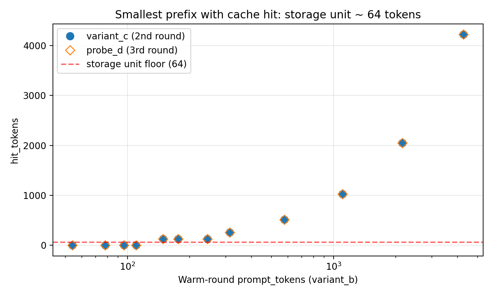
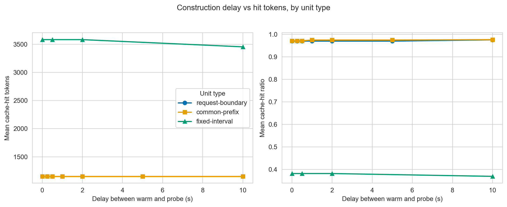
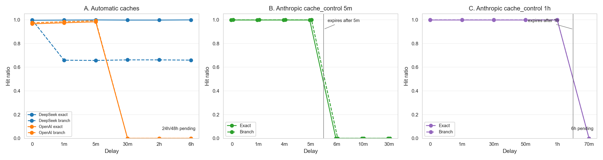
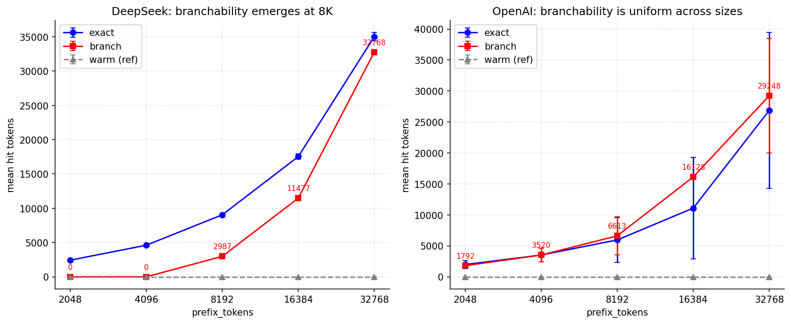
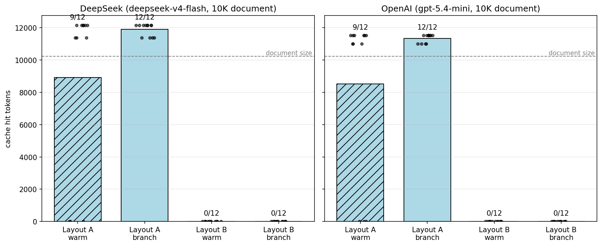
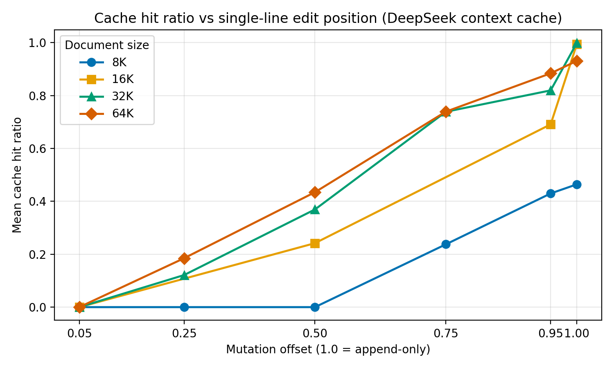

# Black-box characterization of LLM serving caches: contracts, asymmetries, and prompt design

<div class="tool-callout" role="note" aria-label="Research Copilot announcement">
  <div class="tool-callout-text">
    <span class="tool-callout-label">New tool</span>
    This blog is created with the help of <strong>Research Copilot / PiPilot</strong> for Idea Brainstorm, Coding, Executing, Analyzing, and Writing. You can check the open-source tool
  </div>
  <div class="tool-callout-actions">
    <a class="primary" href="https://daidong.github.io/PiPilot/">Visit site</a>
    <a href="https://github.com/daidong/PiPilot">GitHub</a>
    <a href="post.html?slug=introducing-research-copilot">Read note</a>
  </div>
</div>

Production LLM APIs now expose some form of prompt or context caching. The promise is attractive: if a request repeats a long prefix, the provider can reuse server-side state, lower input cost, and reduce prefill latency. For a RAG system, a coding agent, or a long-document QA product, that sounds like free performance.

The practical question is not whether a provider has a cache. It is what contract the cache exposes to the client. Does it match repeated text anywhere in the prompt, or only the serialized prefix? Does changing the system prompt invalidate the document? Can one long warm request make shorter later prefixes reusable? How long does the cached state survive without reuse? Do explicit cache breakpoints behave differently from automatic provider caches?

We measured these questions as a black-box systems problem. Code, configs, result files, and plotting scripts are in the public repository: [`github.com/daidong/llmcache-probe`](https://github.com/daidong/llmcache-probe).

The high-level result is simple and known by everyone:

> Stable material must appear first. Variable material must appear last.

However, we have some more interesting results: **the providers agree on prefix identity but differ sharply in the rest of the contract**. DeepSeek exposes 64-token accounting, deterministic long-prefix checkpoints, a warm-size threshold for branchability\*, and an automatic cache horizon that survived at least six hours in the current run. OpenAI exposes the same placement rule through automatic cached-token accounting, but its automatic horizon was alive at five minutes and gone by thirty minutes in this run. Anthropic exposes a control-plane version of the same idea: the application chooses cache breakpoints, and the documented 5-minute and 1-hour TTLs showed up as hard cliffs.

A practical summary of the discoveries:

* **Serialized prefix:** The cache reuses only text that starts at the first serialized token; repeated text in the middle or at the end does not count.
* **64-token unit:** DeepSeek's hit counter moves in 64-token chunks, so small edits near a boundary can look like sudden jumps.
* **One request warms:** Once a prefix is long enough to be cacheable, one completed request can warm the next compatible call.
* **No warming sleep:** In our tests, probing immediately after the warm request returned hit just as well as waiting.
* **Cache horizon:** TTL is provider-specific: DeepSeek lasted at least six hours here, OpenAI fell between five and thirty minutes, and Anthropic followed its declared TTLs.
* **Long-prompt checkpoints:** Long DeepSeek prompts expose repeatable internal checkpoints, but clients do not choose where those checkpoints land.
* **Coexisting prefixes:** Providers can remember multiple old prefixes, but whether you can branch from a shorter prefix depends on the provider and prefix size.
* **Assistant replies:** Replaying prior assistant text did not increase the visible cached prefix in the DeepSeek chat test.
* **System prompt:** Keep system prompts stable; making a stable system prompt longer did not materially hurt hit rate in these runs.
* **Long-document QA:** Put the document before the question; document-first hit reliably, while question-first missed reliably.
* **Edits:** Cache reuse follows the longest unchanged prefix, so early edits are expensive and appends are safest.
* **Repo prompts:** Serialize repository context in a stable canonical order; shuffled or query-first file bundles lose reuse.

## How prefix caches work

During autoregressive inference, the model first processes the input prompt. This prefill phase computes key and value states for every token at every transformer layer. The decode phase then generates new tokens one at a time while reading those cached states. Long prompts make prefill expensive because the model has to process thousands or tens of thousands of input tokens before the first output token appears.

A prompt cache tries to avoid recomputing that prefill work when later requests begin with the same text. If a request starts with a previously seen prefix, the server can reload or reuse the key-value state for that prefix and compute only the new suffix. At the serving-system level, this connects prompt design to memory management, scheduling, and storage. vLLM's PagedAttention showed how block-based KV-cache management can reduce memory waste and improve serving throughput. Radix-tree and prompt-aware schedulers, including work such as Preble, treat prefix sharing as a scheduling signal. Disaggregated serving systems such as Mooncake make KV state a first-class object that can move through GPU, CPU memory, network, and storage resources.

Those systems are usually evaluated from the provider side. They ask how to allocate GPU memory, place prefill work, route requests, and decide which KV states to keep. The API user sees a narrower surface: a prompt goes in, usage counters come out, and sometimes the billed tokens or latency change. That surface is still enough to shape application behavior. If a provider's cache is prefix-only, then placing a user question before a document is not a neutral formatting choice. It is a cache policy that makes the repeated document invisible to reuse.

This distinction is the central framing for the study. The provider implements an internal cache. The client experiences a cache contract.

## What the public contracts say

DeepSeek publishes the richest public story among the providers we tested. Its API documentation describes context caching on disk, enabled by default. It reports `prompt_cache_hit_tokens` and `prompt_cache_miss_tokens`, uses 64 tokens as the documented cache storage unit, says each request triggers cache construction, and describes persistence at request boundaries, common prefixes, and fixed token intervals for long inputs and outputs. The release note also reports that cache-hit input tokens are roughly an order of magnitude cheaper than cache misses, with first-token latency on a 128K high-reference prompt dropping from 13 seconds to 500 milliseconds.

DeepSeek also gives a plausible architectural reason why durable context caching can work. DeepSeek-V2 introduced Multi-head Latent Attention, which compresses the KV state. The report gives a compressed latent dimension `d_c = 512`, a decoupled RoPE key dimension `d_R_h = 64`, and `l = 60` layers. A simple BF16 estimate gives:

```text
elements per token = (512 + 64) * 60                =  34,560
bytes per token    = 34,560 * 2                     =  69,120  ~= 67.5 KiB
64-token unit      ~= 4.22 MiB
128K-token prefix  ~= 8.44 GiB
```

OpenAI exposes automatic prompt caching through cached-token accounting. In the coda runs here, nonzero cached-token values appeared in 128-token increments. Anthropic exposes a different surface: prompt caching is controlled by cache-control breakpoints, and the API reports cache creation and cache reads around those breakpoints. These counters are not semantically identical across providers, so we compare only the outcomes that each API actually supports.

| Provider  | Cache API shape                                                                                             | What we used it to test                                                                                                                     |
| --------- | ----------------------------------------------------------------------------------------------------------- | ------------------------------------------------------------------------------------------------------------------------------------------- |
| DeepSeek  | Automatic context cache; `prompt_cache_hit_tokens` and `prompt_cache_miss_tokens`; documented 64-token unit | Prefix semantics, unit granularity, construction delay, fixed-interval checkpoints, branchability, mutation sensitivity, prompt layout, TTL |
| OpenAI    | Automatic prompt cache; cached-token accounting in prompt token details                                     | Cross-provider layout behavior, construction-delay coda, branchability comparison, short automatic TTL                                      |
| Anthropic | Explicit `cache_control` breakpoints; cache creation and cache read accounting; documented TTL controls     | Whether explicit breakpoints bypass prefix identity, and whether documented TTLs are visible as cliffs                                      |

The public contracts agree on one broad principle: prompt caching is about prefix identity. They leave several application-level questions open. Does a single completed request warm the next one? Does a client need to sleep while the cache is constructed? If a request warms `P + T`, can a later request reuse only `P`? Does an assistant reply extend the visible cache prefix in a chat transcript? When a long document is repeated, does the cache care that it is the same document, or does it care where the document sits in the serialized prompt? And how literal are TTL statements under real API behavior?

## Measurement setup

Most experiments use `max_tokens=1` to isolate prefill and cache accounting from generation cost, `temperature=0`, streaming with usage enabled, and a fresh namespace per trial to prevent accidental reuse across scenarios.

Shorter-prefix probes can contaminate later probes because a probe request can itself warm the cache. For fixed-interval and branchability experiments, we therefore use one warm request and one probe request per independent trial whenever the later probe could create a new shorter-prefix cache entry. In addition, TTL experiments must use disjoint prefixes per delay bucket. If the same prefix is probed at one minute, five minutes, and thirty minutes, the one-minute probe may refresh or rewrite the cache, so the thirty-minute result no longer measures an untouched cache entry.

For the provider comparison, the harness maps each API into a coarse common schema: cache hit or read tokens, miss or newly billed input tokens, cache creation tokens when exposed, prompt tokens, TTFT, and fingerprints. DeepSeek and OpenAI expose automatic cache accounting. Anthropic exposes explicit cache creation and cache read. The figures and tables below avoid treating these as the same counter when they are not.

## The cache sees the serialized prefix

The first sanity check was whether the cache matches arbitrary repeated text or only repeated prefixes. We used one stable string `A` and three layouts:

```text
Prefix repeat:  A + B, then A + C
Middle repeat:  X + A + B, then Y + A + C
Suffix repeat:  B + A, then C + A
```

Only the prefix repeat produced hits. Middle and suffix repetition produced zero hits, even though `A` was byte-identical.

That result is not surprising, but it is the rule that explains the rest of the post. The cache does not match a document because it is the same document. It matches a serialized prompt prefix. If any token before the document changes, the document is no longer in the same prefix position.

The OpenAI placement coda produced the same application result. With a roughly 4K-token synthetic document on `gpt-5.4-mini`, `system + document + question` reached a mean warmed hit ratio of 0.946 on rounds 2-4, while `system + question + document` stayed at 0.000. The provider changed. The layout failure did not.

Anthropic adds a useful control because its cache is explicit. We marked the system and document blocks with `cache_control`, then read them on later calls. Reusing the exact system-plus-document prefix hit at about 0.998. Mutating one character in the system text, or one line near the front of the document, dropped the read hit to zero. Restoring the original prefix hit again. A breakpoint declares what to cache; it does not make a changed prefix equivalent.

## The 64-token unit leaks through DeepSeek's counter

DeepSeek's release note says the storage unit is 64 tokens. The API counter makes that visible.

We swept a common-prefix scenario across shared-prefix sizes from roughly 16 to 4096 tokens, using independent namespaces for every trial. The first nonzero hit appeared later than a literal reading of "64 tokens" might suggest.



| approx size | mean prompt tokens | variant B hit | variant C hit | probe D hit |
| ----------: | -----------------: | ------------: | ------------: | ----------: |
|          16 |                 54 |             0 |             0 |           0 |
|          32 |                 78 |             0 |             0 |           0 |
|          48 |                 96 |             0 |             0 |           0 |
|          64 |                110 |             0 |             0 |           0 |
|          96 |                149 |             0 |           128 |         128 |
|         128 |                176 |             0 |           128 |         128 |
|         256 |                313 |             0 |           256 |         256 |
|         512 |                577 |             0 |           512 |         512 |
|        1024 |               1103 |             0 |          1024 |        1024 |
|        4096 |               4276 |             0 |          4224 |        4224 |

At about 110 prompt tokens, the prefix was still uncached. At about 149 prompt tokens, the next request reported exactly 128 hit tokens. The visible threshold is closer to "two aligned 64-token units are available" than to "anything above 64 tokens hits." Across the project result files, every nonzero DeepSeek `prompt_cache_hit_tokens` value we checked was a multiple of 64. The storage unit is not just documentation language. It is visible in the usage report.

OpenAI showed the same kind of provider-specific quantization leak, but at a different scale. In the coda sweep, every nonzero `cached_tokens` value was a multiple of 128. A 1280-token anchor did not report a cache read until the appended prompt crossed a larger aligned boundary; 2048- and 4096-token anchors reported rounded cached-token values such as 1792, 2304, 3840, and 4352. The general point is not that every provider shares DeepSeek's 64-token unit. It is that cache counters are quantized, and small prompt edits near a boundary can look discontinuous.

Anthropic should be read differently. We did not infer a token-unit boundary from Anthropic counters. Its application-facing control surface is the breakpoint. The developer chooses which prefix spans to write, and those spans must remain byte-stable before the breakpoint.

## One completed request is enough

DeepSeek's API guide uses an example with three requests: `A + B`, `A + C`, then `A + D`. Read literally, that can sound as if DeepSeek needs to observe two variants before the shared prefix becomes reusable.

The threshold sweep showed otherwise. At every prefix length that hit at all, the second request (`variant C`) reported the same hit-token count as the third request (`probe D`). We did not observe a case where the second request missed and the third hit. Once a prefix crosses the reportable threshold, one completed request is enough to make it useful for the next compatible request.

This distinction matters for application design. If a long document is likely to be queried repeatedly, the first real user request can serve as the warm request. There is no need to manufacture two synthetic variants solely to make a common prefix visible.

## A cache-warming sleep did not help

DeepSeek's documentation says construction takes seconds. That sounds like a client might need to wait after a warm request before issuing the next one. We tested delays for three unit types:

| Unit type                           | Delay range |    Probe hit tokens |
| ----------------------------------- | ----------: | ------------------: |
| Request-boundary, 1024-token prefix |   0 to 10 s | 1152 at every delay |
| Common-prefix, 1024-token prefix    |   0 to 10 s | 1152 at every delay |
| Fixed-interval, 16K warm / 8K probe | 0, 0.5, 2 s | 3584 at every delay |
| Fixed-interval, 16K warm / 8K probe |        10 s |           3456, n=1 |



From the client side, the cache was ready when the warm request finished streaming. A delay of 0 seconds produced the same hit-token count as longer waits for the tested request-boundary, common-prefix, and fixed-interval cases. The documentation may be describing internal asynchronous work, but the tested API behavior does not justify adding a client-side sleep after a warm request returns.

The OpenAI delay coda matched this application rule. After a roughly 2K-token warm request, probes at 0, 200, 500, 1000, 2000, and 5000 milliseconds all reported the same mean cached-token count, 1792, and the same mean hit ratio, about 0.849. That should not be generalized to every model or load condition, but it weakens the idea that a cache-warming sleep is a useful default optimization.

## Cache horizon is not portable

Construction delay asks whether the cache is usable immediately after a warm request returns. TTL asks a different question: how long does an untouched prefix remain usable? This is the easiest experiment to contaminate, because every probe can refresh or rewrite the cache. In the sentinel run, each provider, probe kind, and delay bucket received a disjoint 12K document-first prefix. We warmed it once, waited, and probed it once.



| Provider / arm               | Probe type                             |                                      Hit through |               First miss observed | Reading                                                                                       |
| ---------------------------- | -------------------------------------- | -----------------------------------------------: | --------------------------------: | --------------------------------------------------------------------------------------------- |
| DeepSeek automatic           | Exact replay                           |                        6h, 0.996-0.999 hit ratio | Not yet observed; 24h/48h pending | Request-boundary reuse survived at least six hours                                            |
| DeepSeek automatic           | Same document, fresh question          | 6h, nonzero; mean positive hit ratio about 0.716 | Not yet observed; 24h/48h pending | The durable branchable checkpoint survived, but branch reuse is not identical to exact replay |
| OpenAI automatic             | Exact replay and fresh-question branch |                    5m, about 0.97-0.99 hit ratio |                               30m | Automatic cache horizon fell in `(5m, 30m]` in this run                                       |
| Anthropic 5m `cache_control` | Exact replay and fresh-question branch |         5m, about 0.998-0.999 positive hit ratio |                                6m | The documented 5-minute TTL appeared as a hard cliff                                          |
| Anthropic 1h `cache_control` | Exact replay and fresh-question branch |         1h, about 0.998-0.999 positive hit ratio |                               70m | The documented 1-hour TTL appeared as a hard cliff                                            |

The Anthropic rows are the cleanest because the API exposes both cache reads and cache creation. Before expiry, the probe returned about 20K cache-read tokens and no large cache creation for the document span. After expiry, `hit_tokens = 0` and `cache_creation_tokens ≈ 20K`, which means the probe rewrote the cached span.

The DeepSeek rows are different. Exact replays stayed almost fully cached through six hours. Branch probes also stayed alive through six hours, but they reported an internal checkpoint rather than the full exact prefix. That matches the earlier size-gated checkpoint story: DeepSeek has durable addressable structure inside long prefixes, but branch reuse is not the same as exact replay. The DeepSeek/OpenAI sentinel was still running at the time of this writeup, waiting on the 24h and 48h DeepSeek lanes. The Anthropic sentinel had completed.

The useful conclusion is not a provider ranking. It is that "prompt cache" is not one portable contract. Prefix identity is common. Horizon and branch addressability are provider-specific.

## Long prompts create deterministic checkpoints

DeepSeek's documentation says long inputs and outputs are divided into prefix units at fixed token intervals. The API exposes evidence of those units, but not their exact placement.

We warmed a long prompt once, then sent one shorter prompt that shared the warm prefix. Each warm/probe pair used a fresh namespace so that shorter probes could not contaminate later probes.

| Warm prefix | Probe prefix | Hit tokens |
| ----------: | -----------: | ---------: |
|         16K |           4K |          0 |
|         16K |           6K |       1024 |
|         16K |           8K |       3328 |
|         16K |          12K |       7808 |
|         64K |           8K |       3328 |
|         64K |          12K |       7808 |
|         64K |          16K |      12288 |
|         64K |          24K |      21376 |
|         64K |          32K |      32768 |

The 64K run passes through the same 8K and 12K hit-token points as the 16K run before extending. Repeated trials had zero hit-token standard deviation. That is consistent with deterministic fixed-position units rather than random provider-side availability.

The catch is control. Exact request-boundary reuse is predictable. Shorter-prefix reuse from long prompts is useful, but it depends on internal checkpoint positions that the application does not directly choose.

## Multiple old prefixes can coexist, but branchability differs

The portfolio experiment separates two questions that are easy to conflate. After warming four independent requests `P_i + T_i`, can a later request still hit on an exact extension `P_i + T_i + Z_i`? And can it branch from only `P_i + U_i`?

At `P_i ≈ 2K`, DeepSeek answered yes to the first question and no to the second. All exact extensions hit after interleaved warms: 8/8 probes returned either 2304 or 2432 hit tokens, with a mean hit ratio of 0.985. All branch probes missed: 0/8 returned nonzero hit tokens. Standing alone, that looks like a no-branching rule.

It is not. The earlier fixed-interval experiment had already shown deterministic shorter-prefix hits from long warmed requests. A 16K warm could produce 1024 hit tokens on a 6K probe and 3328 hit tokens on an 8K probe. The threshold sweep resolved the tension by running the same portfolio setup across prefix sizes.



| Prefix size | DeepSeek branch mean hit / nonzero | OpenAI branch mean hit / nonzero |
| ----------: | ---------------------------------: | -------------------------------: |
|          2K |                           0 / 0/12 |                     1792 / 12/12 |
|          4K |                           0 / 0/12 |                     3520 / 11/12 |
|          8K |                       2987 / 12/12 |                     6613 / 10/12 |
|         16K |                      11477 / 12/12 |                    16128 / 12/12 |
|         32K |                      32768 / 12/12 |                    29248 / 11/12 |

DeepSeek's transition is sharp. Below 8K, branch hits are exactly zero across 24 portfolio probes. At and above 8K, every one of 36 branch probes hits. The 32K cell is especially clean: all 12 probes returned exactly 32768 hit tokens, so the whole warmed `P_i` became addressable as a unit.

OpenAI uses a different automatic-cache policy. Its branch probes were nonzero at every measured prefix size, including 2K and 4K where DeepSeek was flat zero. The exact rows were noisier at larger sizes, so this should not be turned into a hard availability guarantee, but the directional result is clear: OpenAI exposed shorter-prefix reuse without DeepSeek's warm-side threshold.

Anthropic is the control case because the application chooses breakpoints. If we marked the full `P_i + T_i` boundary, exact extensions hit and branches missed. If we marked only `P_i`, both exact extensions and branches hit. For Anthropic, branchability is not something to infer from hidden unitization. It is a cache-control decision.

## Assistant replies did not extend the visible prefix

DeepSeek's API guide says prefix units are persisted at the end of user input and at the end of model output. The user-input half is easy to observe. The output half requires a chat replay: ask for a long assistant response, then send that assistant response back as a prior turn.

Each trial warmed `[system_v1, user_W]` with `max_tokens = 400`, captured the assistant reply `R`, and then probed four follow-up variants.

| Probe                                                                  | Prompt tokens | Hit tokens | Miss tokens |
| ---------------------------------------------------------------------- | ------------: | ---------: | ----------: |
| Exact assistant `[system_v1, user_W, assistant(R), user_E]`            |          2619 |       2176 |         443 |
| Truncated assistant `[system_v1, user_W, assistant(R[:half]), user_E]` |          2441 |       2176 |         265 |
| No assistant `[system_v1, user_W, user_E]`                             |          2215 |       2176 |          39 |
| System changed `[system_v2, user_W, assistant(R), user_E]`             |          2619 |          0 |        2619 |

Exact replay, truncated replay, and omitting the assistant turn all returned the same 2176 hit tokens (`34 × 64`). Changing the system prompt dropped the hit to zero.

Output-boundary persistence may exist inside DeepSeek's cache, but it did not show up through this chat serialization. The visible cache contract stopped at the user-input prefix. For multi-turn agents, budget reuse against the user-input portion of the conversation. Do not assume the previous assistant reply extends the cached prefix you can observe.

## System prompt stability matters. Length mostly did not.

The system message is part of the serialized prefix. A small system-prompt version change wiped out document reuse in the long-document runs.

| Round                   | 8K hit ratio | 16K hit ratio |
| ----------------------- | -----------: | ------------: |
| `warm_v1`               |        0.000 |         0.000 |
| `probe_same_system`     |        0.989 |         0.995 |
| `probe_changed_system`  |        0.000 |         0.000 |
| `probe_volatile_header` |        0.000 |         0.000 |

A one-line `ts=... nonce=...` header before the document had the same effect as changing the system prompt. Anything that mutates before the stable region moves the document off the cached prefix.

The length of a stable system prompt is a different issue. In a separate sweep, we used the same 4K document and question while varying the system prompt size from 32 to 1024 approximate tokens. The warm request missed, as expected. The probe request hit at essentially the same ratio across all sizes.

| Approx system size | Mean prompt tokens | Probe hit tokens | Probe hit ratio |
| -----------------: | -----------------: | ---------------: | --------------: |
|                 32 |               4942 |             4864 |           0.984 |
|                 64 |               4976 |             4864 |           0.978 |
|                128 |               5042 |             4992 |           0.990 |
|                256 |               5177 |             5120 |           0.989 |
|                512 |               5446 |             5376 |           0.987 |
|               1024 |               5982 |             5888 |           0.984 |

This is why "pack the system prompt" is the wrong first optimization target. The cache did not punish a longer stable system prompt in these runs. It punished instability before the document. Keep the system prompt deterministic. Do not spend engineering effort shortening it to chase cache hits unless length changes where the stable content crosses a cache-unit boundary.

Anthropic makes the same point in a sharper way. We marked both the system block and the document block with `cache_control`. Replaying the same prefix produced cache reads; appending one character to the system text produced a full miss and a new cache creation. Explicit cache controls do not exempt the system prompt from prefix identity.

## Long-document QA is almost binary

The workload-shaped experiment used a 10,240-token synthetic document, comfortably above DeepSeek's measured branchability threshold, and compared two layouts:

```text
Layout A: system + document + Q_i, then system + document + Q_j
Layout B: system + Q_i + document, then system + Q_j + document
```

The document is repeated across requests within each layout. Layouts are separately namespaced so one layout cannot warm the other.



| Provider | Layout         | Branch probes | Mean cache-hit tokens | Nonzero |
| -------- | -------------- | ------------: | --------------------: | ------: |
| DeepSeek | Document first |            12 |                 11904 |   12/12 |
| DeepSeek | Question first |            12 |                     0 |    0/12 |
| OpenAI   | Document first |            12 |                 11349 |   12/12 |
| OpenAI   | Question first |            12 |                     0 |    0/12 |

This is the cleanest application-facing result in the study. Once the stable document is placed before the variable question, both providers report a near-full cache read on every branch probe. Move the question before the document and both providers report exactly zero cache-hit tokens, even though the long document is still repeated across calls.

The first warm request in each fresh document namespace is cold by construction, which explains the three zero-hit warm rows in the raw table. The branch probes are the relevant line: 12/12 hits for document-first, 0/12 for question-first on both providers.

At 64K in the earlier DeepSeek-only layout sweep, the layout choice was roughly a 10x input-cost difference under DeepSeek's hit-token discount. Latency improved too, but less dramatically. In that run, `doc_first` dropped from 3.64 seconds cold to about 1.55 seconds on warmed rounds, while `question_first` dropped from 3.39 seconds to about 1.88 seconds without reporting hits. For this workload, the main win is input-token cost. Latency is secondary and noisier.

## Edits invalidate by longest common prefix

Real documents change. The cache survives edits according to where the first change appears. We warmed a document, then probed with one body line mutated at a known offset.



| Doc size | 25% edit | 50% edit | 75% edit | 95% edit | Append |
| -------: | -------: | -------: | -------: | -------: | -----: |
|      32K |    0.121 |    0.369 |    0.739 |    0.819 |  0.999 |
|      64K |    0.185 |    0.434 |    0.739 |    0.884 |  0.931 |

At 32K and 64K, the curve looks like longest-common-prefix invalidation. Later edits preserve more prefix. Appends preserve almost all of it, except for residual miss slack from internal unit boundaries.

The 8K case was a useful warning. At roughly 11K total prompt length after scaffolding, partial reuse had not crossed the long-prefix checkpoint threshold, so early edits showed zero hits. Once the warm prompt is large enough for fixed-interval units to appear, the LCP pattern is visible.

For application code, edit late when you can, append when you can, and avoid changing the beginning of a large stable region.

## Repo prompts need canonical order

Repo-QA and coding-agent prompts serialize many files. If file order changes with retrieval score, query wording, or agent state, the prompt may contain the same files but lose the prefix.

Five layouts on a synthetic 8-file repository with about 8K total file content produced the following DeepSeek results:

| Layout      | Template                                                        | Rounds 2-3 / probe hit ratio |
| ----------- | --------------------------------------------------------------- | ---------------------------: |
| Canonical   | `system + file_tree + files_in_canonical_order + Q_n`           |                        0.988 |
| Query-first | `system + Q_n + file_tree + files`                              |                        0.000 |
| Shuffled    | `system + tree_shuffled(seed_n) + files_shuffled(seed_n) + Q_n` |                        0.000 |
| Early edit  | Canonical + one line of file 0 mutated                          |                        0.000 |
| Late edit   | Canonical + one line of file 7 mutated                          |                        0.388 |

Canonical ordering gives near-full reuse. Query-first placement gives none. Shuffling the same file set also gives none, because the cache sees serialized order rather than the application-level set of files. The early-edit and late-edit pair shows the same LCP rule at file-bundle scale.

A coding agent that wants cache reuse should serialize repository context with a stable policy, such as path-lexicographic order. Retrieval-score order is often the wrong default if the score changes for every user question. Keep the file tree and file bodies in the same order across calls. Put frequently changing material late in the bundle when possible.

## The contract we would build against

The results support a provider-general contract and several provider-specific details.

| Behavior                                                                                                    | Provider scope                                                                                                            | Practical reading                                                                              |
| ----------------------------------------------------------------------------------------------------------- | ------------------------------------------------------------------------------------------------------------------------- | ---------------------------------------------------------------------------------------------- |
| The cache matches the serialized prompt prefix from the first token, system message included                | Seen in DeepSeek; reinforced by OpenAI placement and Anthropic prefix-mutation probes                                     | Stable material must appear before variable material                                           |
| Repeated content after a changed prefix does not hit                                                        | Seen in DeepSeek; OpenAI question-first and Anthropic mutation probes show the same failure mode                          | Do not expect substring or semantic reuse                                                      |
| Cache counters are quantized                                                                                | DeepSeek nonzero hits were multiples of 64; OpenAI coda hits were multiples of 128                                        | Do not overfit boundary effects to semantic differences                                        |
| DeepSeek prefixes around 110 prompt tokens still missed; around 149 prompt tokens hit with 128 tokens       | DeepSeek-specific measurement                                                                                             | The first visible DeepSeek hit needs roughly two aligned 64-token units in this setup          |
| One completed request is enough to warm a compatible next request                                           | DeepSeek measurement; consistent with the OpenAI coda's immediate reads                                                   | No need to observe two variants before using a shared prefix                                   |
| A 0-second post-warm delay hit as well as longer delays in the tested cases                                 | DeepSeek and OpenAI coda                                                                                                  | Do not add cache-warming sleeps after the warm request returns                                 |
| Cache horizon is provider-specific                                                                          | DeepSeek survived through 6h and is pending at 24h/48h; OpenAI missed by 30m; Anthropic hit at 5m/1h and missed at 6m/70m | Treat cache age as part of the prompt contract                                                 |
| Long prompts expose deterministic but opaque checkpoint units                                               | DeepSeek-specific measurement                                                                                             | Exact request-boundary reuse is predictable; shorter-prefix reuse needs a committed checkpoint |
| Multiple warmed request-boundary prefixes can remain addressable                                            | DeepSeek and OpenAI portfolio probes; Anthropic when breakpoints are explicit                                             | Cache persistence is not limited to only the last request                                      |
| Branching from a shorter prefix inside a warmed longer request is provider-specific                         | DeepSeek is size-gated; OpenAI branch reuse appeared at every measured size; Anthropic depends on breakpoint placement    | Do not assume hidden caches expose every sub-prefix                                            |
| At 10K workload scale, document-first and question-first layouts diverge sharply                            | DeepSeek and OpenAI both hit 12/12 for document-first branch probes and 0/12 for question-first branch probes             | Prompt layout is cache policy                                                                  |
| Assistant replies did not extend the visible prefix in chat replay                                          | DeepSeek-specific measurement                                                                                             | Budget multi-turn reuse against the user-input prefix                                          |
| Later edits preserve more cache than earlier edits                                                          | DeepSeek mutation sweep; Anthropic mutation probe confirms early prefix changes miss                                      | Treat document updates as longest-common-prefix invalidations                                  |
| Stable system prompt length from 32 to 1024 approximate tokens did not materially change DeepSeek hit ratio | DeepSeek-specific measurement; Anthropic confirms system text identity matters                                            | Stability and placement matter more than packing                                               |

The shortest operational rule is still: stable prefix first, variable tail last.

Do not put a timestamp, request id, user id, feature flag, query-dependent file order, or the user question in front of the content you want cached.

## What this changes in client-side design

The cache contract turns prompt layout into a systems interface. It is tempting to treat prompts as free-form text, where equivalent natural-language instructions can be rearranged for readability. That intuition breaks down once the provider exposes a prefix cache. Two prompts can contain the same document, the same question, and the same task instruction, yet one prompt mostly hits the cache and the other pays the full prefill cost. The difference is not semantic. It is serialization.

For long-document QA, the safest template is boring:

```text
system: stable task policy and output format
user: stable document or document bundle
user: variable question
```

The risky template is the one many applications write first:

```text
system: stable task policy and output format
user: variable question
user: stable document or document bundle
```

Both are easy for a model to answer. Only the first one gives the provider a reusable prefix. In the 10K workload experiment, this one ordering decision separated 12/12 branch hits from 0/12 branch hits on both DeepSeek and OpenAI. If the document is long and reused across questions, the question belongs after the document, even if the question-before-document format reads more naturally to a human.

For RAG systems, the result argues for a stable context envelope around retrieved material. A common anti-pattern is to let retrieval score determine the full serialization order for every query. That may improve local relevance ordering, but it also destroys prefix stability because the first chunk changes with each question. A cache-aware design separates stable and variable structure. If the same knowledge base, policy manual, or codebase is queried repeatedly, serialize the stable bundle in a canonical order and put the query-dependent reasoning instruction after it. If retrieval must vary, put the highest-reuse material first and the volatile retrieved tail later. This does not mean ignoring retrieval quality. It means recognizing that retrieval order is now a cost and latency decision as well as a relevance decision.

For coding agents, the repo-layout result is the most direct warning. A file set is not a prefix. A provider cache cannot see that two prompts contain the same files if the file order changes. It sees a token stream. A cache-aware coding agent should use a stable file tree, stable file-body order, and stable separators. Path order is a good default because it is deterministic and easy to audit. Retrieval-ranked additions can still be useful, but they should be appended after the canonical core rather than used to reshuffle the whole repository context. If the agent edits files during a session, changed files should appear late when possible, or the context builder should isolate a stable prefix from a mutable tail.

For multi-turn chat agents, the output-boundary result argues against a common mental model. It is natural to assume that the whole conversation transcript becomes a growing cached prefix. In our DeepSeek replay experiment, the visible hit count did not increase when the prior assistant response was included. The reusable portion behaved like the user-input prefix, and changing the system prompt still wiped it out. A production chat agent should therefore log actual cache counters rather than budgeting as if every previous assistant message is a cache extender. If the provider later changes this behavior, counters will show it.

For batch evaluation and synthetic workloads, the same rules apply. If a benchmark repeats a rubric, schema, system instruction, or reference corpus across many examples, that stable material should appear before per-example content. If examples are rendered as `question + rubric + reference`, the cache cannot help with the rubric or reference. If they are rendered as `rubric + reference + question`, later examples can reuse the stable prefix. This can change the economics of evaluation pipelines without changing model behavior.

The provider asymmetries change the engineering strategy. With DeepSeek, branchability has a warm-size threshold. Below the threshold, exact request-boundary reuse can work while shorter-prefix branching does not. That makes large stable envelopes especially valuable. With OpenAI, shorter-prefix reuse appeared at smaller measured sizes, but the automatic horizon was shorter in the sentinel run. That makes layout still valuable, but long idle gaps risky. With Anthropic, the application controls breakpoints and TTL class. That makes the prompt template more explicit: place the breakpoint exactly after the prefix you intend to reuse, and keep every token before it stable.

The common mistake is to optimize only the text, not the contract. A shorter prompt that changes early on every request can be worse than a longer prompt whose stable prefix is reused. A dynamic prompt that looks elegant in a template engine can be a cache miss factory if it inserts per-request metadata before the document. A canonical serialization that looks less natural may be the right systems design because it gives the provider a stable object to reuse.

## What these results do not say

The experiments do not identify the internal cache implementation. DeepSeek's 64-token accounting, fixed-interval long-prefix behavior, and size-gated branchability are externally visible. They do not prove a particular data structure. The provider could use several layers: request-boundary persistence, internal checkpoints, routing-dependent cache placement, disk-backed objects, and memory-resident hot entries. The blog's claim is narrower: these mechanisms expose a deterministic enough contract that client applications can shape their prompts around it.

The experiments also do not measure provider capacity. We did not try to fill the cache, evict other entries, test cross-user sharing, or stress global load. Those experiments are expensive, noisy, and often hard to interpret ethically. Cross-user cache sharing would require multiple accounts and would raise privacy and policy questions. Capacity stress would conflate cache policy with rate limits, traffic routing, and provider-side load. The useful engineering question here is simpler: given a normal request stream under one account, which prompt shapes reliably hit?

Finally, the results do not imply that cache-aware layout is always more important than answer quality. Sometimes the model answers better when the question appears before the evidence, or when the prompt uses a task-specific order. In those cases, quality wins. The point is to make the tradeoff explicit. If two layouts are semantically equivalent for the model, choose the one that preserves the stable prefix. If the quality-preferred layout puts volatile material first, log the cache penalty rather than assuming the provider will recover it semantically.

## Production checklist

Before shipping a cache-sensitive prompt, check the following:

* The system prompt is stable across the deployment.

* No timestamp, request id, user id, feature flag, or volatile diagnostic string appears before stable content.

* Long documents, retrieved chunks, schemas, file trees, and file bodies appear before the variable question.

* Multi-file context uses canonical order, such as path-lexicographic order, rather than retrieval-score order.

* Frequently changing material is appended or placed late in the serialized bundle when possible.

* Multi-turn agents budget cache reuse against the user-input prefix only; the assistant's previous reply is not counted as a cache extender.

* The expected reuse interval fits the provider's observed cache horizon. When the API exposes TTL controls, choose them deliberately.

* Production logs sample cache-hit and cache-miss counters together with prompt-template version and age since warm. An unexpected hit-ratio drop should be treated as a prompt-layout or cache-horizon regression.

## Methodology notes and limitations

The experiments are deliberately small and low-volume. They are designed to characterize semantics, not to benchmark provider throughput. A cache contract can be inferred from a few carefully isolated probes if the counters are deterministic. A capacity or eviction benchmark would require a different design, more volume, and stronger controls for global load.

Synthetic prompts are a feature here, not only a limitation. Line-addressable synthetic text makes mutation offsets and prompt layout unambiguous. It also avoids logging user data. The tradeoff is that the results should be interpreted as cache-contract measurements, not as task-quality measurements on natural documents.

The API counters are provider-specific. DeepSeek's `prompt_cache_hit_tokens`, OpenAI's cached-token accounting, and Anthropic's cache-read and cache-creation fields are not interchangeable. The cross-provider claims in this post use binary outcomes and layout contrasts rather than pretending the counters have identical semantics.

TTL remains the noisiest axis. The current DeepSeek/OpenAI sentinel has completed the OpenAI horizon and DeepSeek through six hours, while the DeepSeek 24h and 48h lanes are still pending. The load-conditional TTL experiment was deliberately not run for this version. That means the post supports a lower bound for DeepSeek's automatic horizon in this run, not a final eviction policy.

The results can change with model version, provider rollout, API tier, region, traffic load, or pricing policy. The durable claim is the method and the class of contract questions. If a provider changes the implementation, the same harness should detect which application-facing rules changed.

## Reproducibility

The repository is [`llmcache-probe`](https://github.com/daidong/llmcache-probe). The package `dccprobe` contains the provider wrappers, prompt factories, scenario definitions, and Typer CLI. Suite YAMLs for the original DeepSeek sweeps live under `configs/suites/`. Phase-specific scripts live under `scripts/`.

Key result files:

* Phase 4 unit threshold: `results/phase4_unit_threshold.jsonl`, `results/phase4_unit_threshold_summary.csv`, `figures/phase4_unit_threshold_hit_tokens.{png,svg}`.

* Phase 4 construction delay: `results/phase4_delay_per_unit_type.jsonl`, `results/phase4_delay_per_unit_type_summary.csv`, `figures/phase4_delay_per_unit_type.{png,svg}`.

* Phase 6A branchability threshold: `results/phase6a_branchability_threshold.jsonl`, `results/phase6a_branchability_threshold_summary.csv`, `figures/phase6a_branchability_threshold.{png,svg}`.

* Phase 6B workload layout: `results/phase6b_workload_layout.jsonl`, `results/phase6b_workload_layout_summary.csv`, `figures/phase6b_workload_layout.{png,svg}`.

* Phase 7 TTL sentinel: `results/phase7_ttl_sentinel.jsonl`, `results/phase7_ttl_sentinel_anthropic.jsonl`, `results/phase7_ttl_horizon_current_summary.csv`, `figures/phase7_ttl_horizon_current.{png,svg}`.

* Provider coda runs: `results/coda_openai_placement.jsonl`, `results/coda_openai_unit_increment.jsonl`, `results/coda_openai_construction_delay.jsonl`, `results/coda_openai_prefix_portfolio.jsonl`, `results/coda_anthropic_prefix_mutation.jsonl`, and `results/coda_anthropic_prefix_portfolio.jsonl`.

Reference handles used in this writeup:

* DeepSeek API Docs, "Context Caching," `https://api-docs.deepseek.com/guides/kv_cache`.

* DeepSeek API Docs, "DeepSeek API introduces Context Caching on Disk, cutting prices by an order of magnitude," `https://api-docs.deepseek.com/news/news0802`.

* DeepSeek-AI, "DeepSeek-V2: A Strong, Economical, and Efficient Mixture-of-Experts Language Model," arXiv:2405.04434.

* Kwon et al., "Efficient Memory Management for Large Language Model Serving with PagedAttention," SOSP 2023, DOI:10.1145/3600006.3613165.

* Fu et al., "Preble: Efficient Distributed Prompt Scheduling for LLM Serving," arXiv:2407.00023.

* Qin et al., "Mooncake: A KVCache-centric Disaggregated Architecture for LLM Serving," arXiv:2407.00079.

* OpenAI Cookbook, "Prompt Caching 201," `https://developers.openai.com/cookbook/examples/prompt_caching_201`.

* Anthropic Claude API Docs, "Prompt caching," `https://platform.claude.com/docs/en/build-with-claude/prompt-caching`.

---

# LLM 服务缓存的黑盒测量：契约、差异和 prompt 设计

生产环境里的 LLM API 现在大多提供某种 prompt cache 或 context cache。这个承诺很诱人：如果一个请求重复了很长的前缀，服务商就可以复用服务器端状态，降低输入成本，也减少 prefill latency。对 RAG 系统、coding agent、长文档 QA 产品来说，这听起来像免费的性能提升。

真正的问题不是服务商有没有 cache，而是这个 cache 对客户端暴露了什么契约。它会匹配 prompt 中任意位置的重复文本，还是只匹配序列化后的前缀？改动 system prompt 会不会让文档缓存失效？一次长 warm 请求能不能让之后较短的前缀复用？缓存状态在没有被复用时能活多久？显式 cache breakpoint 和服务商自动发现的前缀 cache 行为是否不同？

我们把这些问题当作一个黑盒系统问题来测。我们没有服务器日志、GPU counter、scheduler trace，也没有服务商内部实现。我们只有 API 调用、usage counter、prompt fingerprint 和 time-to-first-token 测量。这已经足够推断出一个对应用有用的契约。

代码、配置、结果文件和绘图脚本在公开仓库里：[`github.com/daidong/llmcache-probe`](https://github.com/daidong/llmcache-probe)。

高层结论很简单，也几乎是所有人都知道但很容易忘的规则：

> 稳定内容必须放在前面，变化内容必须放在后面。

在一个 10K 文档形状的 workload 里，DeepSeek 的 document-first branch probe 12 次全部命中，平均 11,904 个 cache-hit tokens。同一个文档如果放到变化的问题后面，12 次 probe 全部不命中。OpenAI 在同样规模上给出了相同的二元结果：document-first 是 12/12 命中，question-first 是 0/12 命中。Anthropic 暴露的是显式 cache control，而不是只依赖自动前缀发现；它给出了对应的控制实验结果：即便声明了 cache breakpoint，只要 breakpoint 前面的序列化文本发生变化，仍然 miss。

更有意思的是：**这些服务商都同意 prefix identity，但在其他契约上差异很大**。DeepSeek 暴露出 64-token 计数、确定性的 long-prefix checkpoints、branchability 的 warm-size threshold，以及在当前 run 中至少存活 6 小时的自动 cache horizon。OpenAI 通过自动 cached-token accounting 暴露了同样的布局规则，但在这次 run 中，它的自动缓存 5 分钟还活着，30 分钟时已经消失。Anthropic 暴露的是这个思路的 control-plane 版本：应用自己选择 cache breakpoint，文档中的 5 分钟和 1 小时 TTL 在实验中表现为明确的 cliff。

下面是这组实验的实用版摘要：

* **序列化前缀：** cache 只复用从第一个序列化 token 开始相同的文本；中间或末尾重复不算。
* **64-token 单位：** DeepSeek 的 hit counter 按 64-token 块跳动，所以边界附近的小改动会表现得很突然。
* **一次请求就能 warm：** prefix 足够长之后，一个完成的请求就能让下一次兼容调用命中。
* **不用 sleep：** 在这些测试里，warm request 返回后立刻 probe 和等几秒效果一样。
* **Cache horizon：** TTL 不是通用契约：DeepSeek 在这次 run 里至少活到 6 小时，OpenAI 落在 5 到 30 分钟之间，Anthropic 跟文档 TTL 一致。
* **长 prompt checkpoints：** DeepSeek 的长 prompt 会出现可重复的内部 checkpoint，但客户端不能选择 checkpoint 位置。
* **多个旧 prefix：** cache 可以保留多个旧 prefix，但能不能从较短 prefix branch 取决于 provider 和 prefix size。
* **Assistant 回复：** 在 DeepSeek chat replay 测试中，重放之前的 assistant 文本没有增加可见 cached prefix。
* **System prompt：** system prompt 要保持稳定；在这些 runs 中，稳定 system prompt 变长基本没有伤害 hit ratio。
* **长文档 QA：** 文档放在问题前面几乎总是命中，问题放在文档前面几乎总是 miss。
* **Edit：** 复用量跟 longest common prefix 走，所以早改很贵，append 最安全。
* **Repo prompts：** repository context 要用稳定的 canonical order；shuffle 或 query-first 会丢掉复用。

## 为什么 prefix cache 重要

在自回归推理中，模型首先处理输入 prompt。这个 prefill 阶段会为每个 token、每一层 transformer 计算 key/value state。然后 decode 阶段一次生成一个新 token，并读取这些 cached states。长 prompt 让 prefill 很贵，因为模型必须先处理成千上万甚至数万输入 token，才会产生第一个输出 token。

Prompt cache 试图在后续请求以相同文本开头时避免重复 prefill。如果一个请求从之前见过的 prefix 开始，服务器可以 reload 或复用这个 prefix 的 key-value state，只计算新的 suffix。在 serving system 层面，这把 prompt 设计和内存管理、调度、存储联系了起来。vLLM 的 PagedAttention 展示了 block-based KV-cache management 如何减少内存浪费并提升 serving throughput。Radix-tree 和 prompt-aware schedulers，包括 Preble 这样的工作，把 prefix sharing 当作调度信号。Mooncake 这样的 disaggregated serving system 则把 KV state 作为可以穿过 GPU、CPU memory、network 和 storage 的一等对象。

这些系统通常是从服务商侧评估的。它们问的是如何分配 GPU memory、放置 prefill work、路由请求、决定保留哪些 KV state。API 用户看到的界面更窄：prompt 进去，usage counter 出来，有时 bill token 或 latency 会变化。但这个界面已经足够影响应用行为。如果一个服务商的 cache 只认 prefix，那么把用户问题放在文档前面就不是一个中性的格式选择。它是一个 cache policy，会让重复文档对复用不可见。

这是这组实验的核心 framing。服务商内部实现一个 cache；客户端体验到的是一个 cache contract。

## 公开契约说了什么

在我们测试的服务商里，DeepSeek 公开的信息最丰富。它的 API 文档描述了默认开启的 disk context caching。它报告 `prompt_cache_hit_tokens` 和 `prompt_cache_miss_tokens`，文档中说 cache storage unit 是 64 tokens，每个请求都会触发 cache construction，并描述了 request boundary、common prefix、以及 long input/output 中 fixed token intervals 处的 persistence。release note 还说 cache-hit input tokens 比 cache miss 便宜大约一个数量级，并且在一个 128K high-reference prompt 上，first-token latency 从 13 秒降到 500 毫秒。

DeepSeek 也给出了 durable context caching 可行的架构原因。DeepSeek-V2 引入了 Multi-head Latent Attention，用来压缩 KV state。报告给出的 compressed latent dimension 是 `d_c = 512`，decoupled RoPE key dimension 是 `d_R_h = 64`，层数 `l = 60`。一个简单的 BF16 估算是：

```text
elements per token = (512 + 64) * 60                =  34,560
bytes per token    = 34,560 * 2                     =  69,120  ~= 67.5 KiB
64-token unit      ~= 4.22 MiB
128K-token prefix  ~= 8.44 GiB
```

这只是数量级估计。它不是关于 DeepSeek 当前生产系统 precision、compression、cache layout 或 eviction policy 的声明。重点是 MLA 把 128K prefix 变成了一个很大但可以放到磁盘上的对象。没有某种压缩，persistent context caching 看起来就没那么可信。

OpenAI 通过 cached-token accounting 暴露自动 prompt caching。在这里的 coda runs 中，非零 cached-token values 以 128-token 为增量出现。Anthropic 暴露的是另一种表面：prompt caching 由 cache-control breakpoints 控制，API 在这些 breakpoints 周围报告 cache creation 和 cache reads。这些 counter 在不同 provider 之间语义并不相同，所以我们只比较每个 API 实际支持的结果。

| Provider | Cache API 形态 | 我们用它测试什么 |
| --- | --- | --- |
| DeepSeek | 自动 context cache；`prompt_cache_hit_tokens` 和 `prompt_cache_miss_tokens`；文档中的 64-token unit | Prefix semantics、unit granularity、construction delay、fixed-interval checkpoints、branchability、mutation sensitivity、prompt layout、TTL |
| OpenAI | 自动 prompt cache；prompt token details 里的 cached-token accounting | 跨 provider 的 layout 行为、construction-delay coda、branchability comparison、短自动 TTL |
| Anthropic | 显式 `cache_control` breakpoints；cache creation 和 cache read accounting；文档化 TTL controls | 显式 breakpoint 是否绕过 prefix identity，以及文档化 TTL 是否表现为 cliff |

这些公开契约在一个大原则上是一致的：prompt caching 关心 prefix identity。它们留下了一些应用层问题：一次完成的请求能不能 warm 下一次？客户端需要等 cache construction 吗？如果请求 warm 了 `P + T`，之后能不能只复用 `P`？assistant 回复会不会扩展 chat transcript 中可见的缓存前缀？当长文档重复出现时，cache 关心的是“同一个文档”，还是这个文档在序列化 prompt 中的位置？TTL 说明在真实 API 行为中有多字面？

## 测量设置

Harness 记录 provider 的 cache counters、prompt token counts、model id、scenario id、prompt 和 stable-prefix fingerprints、streaming time to first token、total latency 和 error state。结果文件里不记录完整 prompt 文本。大多数实验用 `max_tokens=1`，把 prefill 和 cache accounting 与生成成本隔离开；`temperature=0`；streaming 并打开 usage；每个 trial 使用 fresh namespace，避免不同 scenario 之间意外复用。

有两个设计细节很关键。第一，shorter-prefix probes 会污染后续 probes，因为 probe 请求本身也可能 warm cache。因此在 fixed-interval 和 branchability 实验中，只要后续 probe 有可能创建新的 shorter-prefix cache entry，我们就用 one warm request + one probe request per independent trial。第二，TTL 实验必须为每个 provider、probe kind 和 delay bucket 使用不相交的 prefix。如果同一个 prefix 在 1 分钟、5 分钟和 30 分钟都被 probe，那么 1 分钟 probe 可能 refresh 或 rewrite cache，30 分钟结果就不再是在测一个 untouched cache entry。

为了做 provider comparison，harness 把每个 API 映射到一个粗粒度的共同 schema：cache hit/read tokens、miss 或 newly billed input tokens、暴露时的 cache creation tokens、prompt tokens、TTFT 和 fingerprints。DeepSeek 和 OpenAI 暴露自动 cache accounting。Anthropic 暴露显式 cache creation 和 cache read。下面的图和表不会把这些不相同的 counter 当成同一个东西。

## cache 看的是序列化前缀

第一个 sanity check 是测试 cache 是否匹配任意重复文本，还是只匹配重复前缀。我们用了一个稳定字符串 `A` 和三种布局：

```text
Prefix repeat:  A + B, then A + C
Middle repeat:  X + A + B, then Y + A + C
Suffix repeat:  B + A, then C + A
```

只有 prefix repeat 产生了 cache hit。middle 和 suffix 的重复都是 0，即使 `A` 是 byte-identical。

这个结果不意外，但它解释了后面所有结果。cache 不会因为文档相同就匹配文档。它匹配的是序列化 prompt prefix。只要文档前面的任何 token 变了，这个文档就不再处在同一个 prefix 位置。

OpenAI placement coda 给出了相同的应用结果。在 `gpt-5.4-mini` 上，用一个大约 4K-token synthetic document，`system + document + question` 在第 2-4 轮达到了 0.946 的 warmed hit ratio，而 `system + question + document` 保持 0.000。provider 换了，layout failure 没换。

Anthropic 提供了一个有用的控制实验，因为它的 cache 是显式的。我们用 `cache_control` 标记 system 和 document blocks，然后在后续调用中读取它们。复用完全相同的 system-plus-document prefix 时，命中大约 0.998。在 system text 中改一个字符，或者在文档前面一行改动，read hit 会掉到 0。恢复原始 prefix 后又重新命中。breakpoint 声明了要 cache 什么；它不会让变化后的 prefix 变成等价 prefix。

## DeepSeek 的 64-token unit 会漏到 counter 里

DeepSeek release note 说 storage unit 是 64 tokens。API counter 直接让这个单位可见。

我们把 common-prefix scenario 从大约 16 tokens 扫到 4096 tokens，每个 trial 都用独立 namespace。第一次非零命中出现得比“64 tokens”字面理解要晚。


| approx size | mean prompt tokens | variant B hit | variant C hit | probe D hit |
| ----------: | -----------------: | ------------: | ------------: | ----------: |
| 16 | 54 | 0 | 0 | 0 |
| 32 | 78 | 0 | 0 | 0 |
| 48 | 96 | 0 | 0 | 0 |
| 64 | 110 | 0 | 0 | 0 |
| 96 | 149 | 0 | 128 | 128 |
| 128 | 176 | 0 | 128 | 128 |
| 256 | 313 | 0 | 256 | 256 |
| 512 | 577 | 0 | 512 | 512 |
| 1024 | 1103 | 0 | 1024 | 1024 |
| 4096 | 4276 | 0 | 4224 | 4224 |

在大约 110 prompt tokens 时，prefix 仍然没有被 cache。在大约 149 prompt tokens 时，下一次请求报告了正好 128 hit tokens。可见阈值更接近“已有两个对齐的 64-token unit”，而不是“超过 64 tokens 就命中”。在项目结果文件中，我们检查过的每个非零 DeepSeek `prompt_cache_hit_tokens` 都是 64 的倍数。storage unit 不只是文档里的说法。它出现在 usage report 里。

OpenAI 也暴露出类似的 provider-specific quantization，只是尺度不同。在 coda sweep 中，每个非零 `cached_tokens` 都是 128 的倍数。一个 1280-token anchor 直到 appended prompt 穿过更大的对齐边界时才报告 cache read；2048- 和 4096-token anchors 报告了 1792、2304、3840、4352 这样的 rounded cached-token values。一般结论不是所有 provider 都共享 DeepSeek 的 64-token unit，而是 cache counters 是量化的，小的 prompt edit 在边界附近可能表现为不连续。

Anthropic 要换一种读法。我们没有从 Anthropic counter 推断 token-unit boundary。它面向应用的控制面是 breakpoint。开发者选择要写入的 prefix span，而 breakpoint 前面的 span 必须 byte-stable。

## 一个完成的请求就够了

DeepSeek API guide 用了三次请求的例子：`A + B`，`A + C`，然后 `A + D`。按字面读，容易觉得 DeepSeek 需要先观察两个 variant，shared prefix 才能复用。

threshold sweep 显示不是这样。只要 prefix 长度能产生 hit，第二个请求（`variant C`）报告的 hit-token count 就和第三个请求（`probe D`）一样。我们没有观察到“第二次 miss、第三次 hit”的情况。prefix 一旦跨过 reportable threshold，一个完成的请求就足够让它对下一个兼容请求有用。

这个区别对应用设计很重要。如果一个长文档很可能被反复查询，第一次真实用户请求就可以作为 warm request。没有必要为了让 common prefix 可见而制造两个 synthetic variants。

## cache-warming sleep 没有帮助

DeepSeek 文档说 construction takes seconds。这听起来像客户端在 warm request 之后应该等一会儿再发下一个请求。我们测了三种 unit type 的 delay：

| Unit type | Delay range | Probe hit tokens |
| --- | ---: | ---: |
| Request-boundary, 1024-token prefix | 0 to 10 s | 1152 at every delay |
| Common-prefix, 1024-token prefix | 0 to 10 s | 1152 at every delay |
| Fixed-interval, 16K warm / 8K probe | 0, 0.5, 2 s | 3584 at every delay |
| Fixed-interval, 16K warm / 8K probe | 10 s | 3456, n=1 |


从客户端看，warm request streaming 结束时 cache 已经可用。0 秒 delay 和更长等待在这些 request-boundary、common-prefix、fixed-interval cases 中给出了相同的 hit-token count。文档也许描述的是内部异步工作，但我们测到的 API 行为不支持在 warm request 返回后人为加 sleep。

OpenAI delay coda 也符合这个应用规则。在大约 2K-token warm request 后，0、200、500、1000、2000、5000 毫秒的 probe 都报告了相同的 mean cached-token count：1792，mean hit ratio 也一样，大约 0.849。这不应该泛化到所有模型或所有负载条件，但它削弱了“cache-warming sleep 是默认优化”的想法。

## cache horizon 不可移植

construction delay 问的是 warm request 返回后 cache 是否立即可用。TTL 问的是另一个问题：一个没有被触碰的 prefix 能活多久？这是最容易污染的实验，因为每个 probe 都可能 refresh 或 rewrite cache。在 sentinel run 中，每个 provider、probe kind 和 delay bucket 都使用一个不相交的 12K document-first prefix。我们 warm 一次，等待，然后 probe 一次。


| Provider / arm | Probe type | Hit through | First miss observed | Reading |
| --- | --- | ---: | ---: | --- |
| DeepSeek automatic | Exact replay | 6h, 0.996-0.999 hit ratio | Not yet observed; 24h/48h pending | Request-boundary reuse 至少存活 6 小时 |
| DeepSeek automatic | Same document, fresh question | 6h, nonzero; mean positive hit ratio about 0.716 | Not yet observed; 24h/48h pending | durable branchable checkpoint 存活了，但 branch reuse 不等于 exact replay |
| OpenAI automatic | Exact replay and fresh-question branch | 5m, about 0.97-0.99 hit ratio | 30m | 这次 run 中 automatic cache horizon 落在 `(5m, 30m]` |
| Anthropic 5m `cache_control` | Exact replay and fresh-question branch | 5m, about 0.998-0.999 positive hit ratio | 6m | 文档中的 5-minute TTL 表现为 hard cliff |
| Anthropic 1h `cache_control` | Exact replay and fresh-question branch | 1h, about 0.998-0.999 positive hit ratio | 70m | 文档中的 1-hour TTL 表现为 hard cliff |

Anthropic 的行最干净，因为 API 同时暴露 cache reads 和 cache creation。过期前，probe 返回约 20K cache-read tokens，并且没有为 document span 产生大量 cache creation。过期后，`hit_tokens = 0` 且 `cache_creation_tokens ≈ 20K`，说明 probe 重写了 cached span。

DeepSeek 的行不同。Exact replay 到 6 小时仍然几乎全部 cached。Branch probes 也存活到了 6 小时，但它们报告的是内部 checkpoint，而不是完整 exact prefix。这和前面的 size-gated checkpoint story 一致：DeepSeek 在 long prefix 内部有 durable addressable structure，但 branch reuse 不等于 exact replay。写这版时，DeepSeek/OpenAI sentinel 仍在等 DeepSeek 的 24h 和 48h lanes，Anthropic sentinel 已经完成。

有用的结论不是 provider ranking，而是“prompt cache”不是一个可移植的统一契约。Prefix identity 是共同的。Horizon 和 branch addressability 是 provider-specific。

## 长 prompt 会产生确定性的 checkpoints

DeepSeek 文档说，long inputs 和 outputs 会在 fixed token intervals 被切成 prefix units。API 暴露了这些 units 的证据，但没有暴露它们的精确位置。

我们先 warm 一个长 prompt，然后发送一个共享 warm prefix 的较短 prompt。每个 warm/probe pair 都使用 fresh namespace，避免 shorter probe 污染后面的 probes。

| Warm prefix | Probe prefix | Hit tokens |
| ----------: | -----------: | ---------: |
| 16K | 4K | 0 |
| 16K | 6K | 1024 |
| 16K | 8K | 3328 |
| 16K | 12K | 7808 |
| 64K | 8K | 3328 |
| 64K | 12K | 7808 |
| 64K | 16K | 12288 |
| 64K | 24K | 21376 |
| 64K | 32K | 32768 |

64K run 在扩展之前经过了和 16K run 相同的 8K、12K hit-token points。重复 trials 的 hit-token standard deviation 是 0。这更像确定性的 fixed-position units，而不是 provider-side 随机可用性。

问题在于控制。Exact request-boundary reuse 是可预测的。从长 prompt 中复用 shorter-prefix 很有用，但它依赖应用不能直接选择的内部 checkpoint 位置。

## 多个旧 prefix 可以共存，但 branchability 不同

portfolio experiment 区分了两个容易混淆的问题。warm 四个独立请求 `P_i + T_i` 之后，后续请求是否还能在 exact extension `P_i + T_i + Z_i` 上 hit？又是否能只从 `P_i + U_i` branch？

在 `P_i ≈ 2K` 时，DeepSeek 对第一个问题回答 yes，对第二个问题回答 no。interleaved warms 后，所有 exact extensions 都 hit：8/8 probes 返回 2304 或 2432 hit tokens，mean hit ratio 是 0.985。所有 branch probes 都 miss：0/8 返回非零 hit tokens。单看这个结果，会像是 no-branching rule。

但不是。前面的 fixed-interval experiment 已经显示，长 warm request 可以产生确定性的 shorter-prefix hits。16K warm 可以在 6K probe 上产生 1024 hit tokens，在 8K probe 上产生 3328 hit tokens。threshold sweep 通过跨 prefix size 运行同一个 portfolio setup 解释了这个张力。


| Prefix size | DeepSeek branch mean hit / nonzero | OpenAI branch mean hit / nonzero |
| ----------: | ---------------------------------: | -------------------------------: |
| 2K | 0 / 0/12 | 1792 / 12/12 |
| 4K | 0 / 0/12 | 3520 / 11/12 |
| 8K | 2987 / 12/12 | 6613 / 10/12 |
| 16K | 11477 / 12/12 | 16128 / 12/12 |
| 32K | 32768 / 12/12 | 29248 / 11/12 |

DeepSeek 的 transition 很尖锐。8K 以下，24 个 portfolio probes 的 branch hits 全是 0。8K 及以上，36 个 branch probes 全部 hit。32K cell 尤其干净：12 个 probes 全都返回正好 32768 hit tokens，所以整个 warmed `P_i` 都变成了可寻址 unit。

OpenAI 使用不同的 automatic-cache policy。它的 branch probes 在每个 measured prefix size 上都是非零，包括 DeepSeek flat zero 的 2K 和 4K。larger sizes 上 exact rows 更 noisy，所以这不应该被写成 hard availability guarantee，但方向很清楚：OpenAI 在没有 DeepSeek warm-side threshold 的情况下暴露了 shorter-prefix reuse。

Anthropic 是 control case，因为 application 选择 breakpoint。如果我们标记完整的 `P_i + T_i` boundary，exact extensions hit，branches miss。如果只标记 `P_i`，exact extensions 和 branches 都 hit。对 Anthropic 来说，branchability 不是从 hidden unitization 中推断出来的东西，而是 cache-control decision。

## assistant 回复没有扩展可见 prefix

DeepSeek API guide 说 prefix units 会在 user input 结束和 model output 结束处 persist。user-input 这半边容易观察。output 这半边需要 chat replay：先请求一个长 assistant response，然后把这个 assistant response 作为 previous turn 再发回去。

每个 trial 用 `[system_v1, user_W]` 加 `max_tokens = 400` warm，捕获 assistant reply `R`，然后 probe 四种 follow-up variants。

| Probe | Prompt tokens | Hit tokens | Miss tokens |
| --- | ------------: | ---------: | ----------: |
| Exact assistant `[system_v1, user_W, assistant(R), user_E]` | 2619 | 2176 | 443 |
| Truncated assistant `[system_v1, user_W, assistant(R[:half]), user_E]` | 2441 | 2176 | 265 |
| No assistant `[system_v1, user_W, user_E]` | 2215 | 2176 | 39 |
| System changed `[system_v2, user_W, assistant(R), user_E]` | 2619 | 0 | 2619 |

完整重放 assistant、截断 assistant、以及完全省略 assistant turn 都返回同样的 2176 hit tokens（`34 × 64`）。改变 system prompt 后 hit 掉到 0。

Output-boundary persistence 也许存在于 DeepSeek 内部 cache 中，但它没有通过这种 chat serialization 表现出来。可见的 cache contract 停在 user-input prefix。对 multi-turn agents 来说，预算 cache reuse 时应该按 conversation 的 user-input portion 计算。不要假设 previous assistant reply 会扩展你能观察到的 cached prefix。

## System prompt 稳定性重要，长度基本不重要

System message 是序列化 prefix 的一部分。一个很小的 system-prompt version change 就会让 long-document runs 的文档复用归零。

| Round | 8K hit ratio | 16K hit ratio |
| --- | ---: | ---: |
| `warm_v1` | 0.000 | 0.000 |
| `probe_same_system` | 0.989 | 0.995 |
| `probe_changed_system` | 0.000 | 0.000 |
| `probe_volatile_header` | 0.000 | 0.000 |

文档前面一行 `ts=... nonce=...` header 和改 system prompt 的效果一样。任何在 stable region 前面变化的东西，都会把文档移出 cached prefix。

稳定 system prompt 的长度是另一个问题。在一次单独 sweep 中，我们使用同一个 4K 文档和问题，把 system prompt size 从大约 32 tokens 变化到 1024 tokens。warm request 如预期 miss。probe request 在所有 size 上基本保持相同的 hit ratio。

| Approx system size | Mean prompt tokens | Probe hit tokens | Probe hit ratio |
| -----------------: | -----------------: | ---------------: | --------------: |
| 32 | 4942 | 4864 | 0.984 |
| 64 | 4976 | 4864 | 0.978 |
| 128 | 5042 | 4992 | 0.990 |
| 256 | 5177 | 5120 | 0.989 |
| 512 | 5446 | 5376 | 0.987 |
| 1024 | 5982 | 5888 | 0.984 |

所以“压缩 system prompt”不是第一个应该优化的目标。在这些 runs 中，cache 没有惩罚更长的稳定 system prompt。它惩罚的是文档前面的不稳定内容。保持 system prompt deterministic。除非长度改变了 stable content 穿过 cache-unit boundary 的位置，否则不要为了追 cache hits 把工程精力花在缩短 system prompt 上。

Anthropic 把这个点说得更尖锐。我们同时用 `cache_control` 标记 system block 和 document block。重放同一 prefix 会产生 cache reads；在 system text 后面 append 一个字符，会产生 full miss 和新的 cache creation。显式 cache control 不会让 system prompt 脱离 prefix identity。

## 长文档 QA 几乎是二元结果

workload-shaped experiment 使用了一个 10,240-token synthetic document，明显超过 DeepSeek 测到的 branchability threshold，并比较两种 layout：

```text
Layout A: system + document + Q_i, then system + document + Q_j
Layout B: system + Q_i + document, then system + Q_j + document
```

每个 layout 内部文档会跨请求重复。不同 layout 使用单独 namespace，所以一个 layout 不能 warm 另一个 layout。


| Provider | Layout | Branch probes | Mean cache-hit tokens | Nonzero |
| --- | --- | ---: | ---: | ---: |
| DeepSeek | Document first | 12 | 11904 | 12/12 |
| DeepSeek | Question first | 12 | 0 | 0/12 |
| OpenAI | Document first | 12 | 11349 | 12/12 |
| OpenAI | Question first | 12 | 0 | 0/12 |

这是这组研究里最干净的 application-facing 结果。一旦稳定文档放在变化问题前面，两个 provider 都在每个 branch probe 上报告 near-full cache read。把问题移到文档前面，两个 provider 都报告正好 0 cache-hit tokens，即使长文档仍然在每次调用中重复。

每个 fresh document namespace 的第一次 warm request 天然是 cold，这解释了 raw table 里三个 zero-hit warm rows。关键行是 branch probes：DeepSeek 和 OpenAI 上 document-first 都是 12/12 hits，question-first 都是 0/12。

在早期 DeepSeek-only 64K layout sweep 中，layout 选择在 DeepSeek hit-token discount 下约等于 10x 输入成本差异。Latency 也改善了，但没那么明显。在那次 run 里，`doc_first` 从 cold 的 3.64 秒降到 warmed rounds 的大约 1.55 秒，而 `question_first` 没有 reported hits，也从 3.39 秒降到大约 1.88 秒。对这个 workload 来说，主要收益是 input-token cost。Latency 是次要且更 noisy 的信号。

## edit 按 longest common prefix 失效

真实文档会变化。cache 能保留多少，取决于第一次变化出现在哪里。我们先 warm 文档，然后在已知 offset 改一行 body line 再 probe。


| Doc size | 25% edit | 50% edit | 75% edit | 95% edit | Append |
| -------: | -------: | -------: | -------: | -------: | -----: |
| 32K | 0.121 | 0.369 | 0.739 | 0.819 | 0.999 |
| 64K | 0.185 | 0.434 | 0.739 | 0.884 | 0.931 |

在 32K 和 64K 上，曲线看起来像 longest-common-prefix invalidation。越晚的 edit 保留越多 prefix。append 几乎保留全部，只会因为内部 unit boundary 留下一点 residual miss slack。

8K case 是一个有用提醒。在 scaffolding 后总 prompt length 大约 11K 时，partial reuse 还没有跨过 long-prefix checkpoint threshold，所以早期 edits 显示为 0 hits。一旦 warm prompt 足够大，fixed-interval units 出现，LCP pattern 就清楚了。

对应用代码来说，能晚改就晚改，能 append 就 append，尽量避免改动大块 stable region 的开头。

## repo prompts 需要 canonical order

Repo-QA 和 coding-agent prompts 会序列化很多文件。如果文件顺序随着 retrieval score、query wording 或 agent state 变化，prompt 可能包含同一批文件，但失去 prefix。

在一个约 8K 总文件内容的 synthetic 8-file repository 上，五种 layout 给出了下面的 DeepSeek 结果：

| Layout | Template | Rounds 2-3 / probe hit ratio |
| --- | --- | ---: |
| Canonical | `system + file_tree + files_in_canonical_order + Q_n` | 0.988 |
| Query-first | `system + Q_n + file_tree + files` | 0.000 |
| Shuffled | `system + tree_shuffled(seed_n) + files_shuffled(seed_n) + Q_n` | 0.000 |
| Early edit | Canonical + one line of file 0 mutated | 0.000 |
| Late edit | Canonical + one line of file 7 mutated | 0.388 |

Canonical ordering 给出 near-full reuse。Query-first placement 完全没有复用。把同一组文件 shuffle 也完全没有复用，因为 cache 看到的是序列化顺序，不是应用层的 file set。early-edit 和 late-edit 展示了同样的 LCP rule，只是尺度变成了 file bundle。

想要 cache reuse 的 coding agent 应该用稳定策略序列化 repository context，比如 path-lexicographic order。Retrieval-score order 如果每个用户问题都会改变，通常不是好的默认选择。file tree 和 file body 的顺序要跨调用保持一致。经常变化的内容尽量放在 bundle 后面。

## 我们会基于什么契约设计系统

这些结果支持一个 provider-general contract，也支持几个 provider-specific details。

| Behavior | Provider scope | Practical reading |
| --- | --- | --- |
| cache 从第一个 token 开始匹配序列化 prompt prefix，包括 system message | DeepSeek 中看到；OpenAI placement 和 Anthropic prefix-mutation probes 强化了这一点 | 稳定内容必须在变化内容前面 |
| changed prefix 后面的重复内容不会 hit | DeepSeek 中看到；OpenAI question-first 和 Anthropic mutation probes 展示了同样 failure mode | 不要期待 substring 或 semantic reuse |
| cache counters 是量化的 | DeepSeek 非零 hits 是 64 的倍数；OpenAI coda hits 是 128 的倍数 | 不要把 boundary effects 过度解释成语义差异 |
| DeepSeek 中约 110 prompt tokens 仍 miss，约 149 prompt tokens 以 128 tokens 命中 | DeepSeek-specific measurement | 这个 setup 中第一次可见 DeepSeek hit 大约需要两个对齐的 64-token units |
| 一个完成的请求足够 warm 下一个兼容请求 | DeepSeek measurement；与 OpenAI coda immediate reads 一致 | 不需要先观察两个 variants 才使用 shared prefix |
| 0 秒 post-warm delay 和更长 delay 在测试中一样命中 | DeepSeek 和 OpenAI coda | warm request 返回后不要加 cache-warming sleep |
| cache horizon 是 provider-specific | DeepSeek 存活到 6h 且 24h/48h pending；OpenAI 30m miss；Anthropic 5m/1h hit，6m/70m miss | cache age 是 prompt contract 的一部分 |
| long prompts 暴露 deterministic but opaque checkpoint units | DeepSeek-specific measurement | exact request-boundary reuse 可预测；shorter-prefix reuse 需要已 committed checkpoint |
| 多个 warmed request-boundary prefixes 可以保持可寻址 | DeepSeek 和 OpenAI portfolio probes；Anthropic 显式 breakpoints 时成立 | cache persistence 不限于最后一个请求 |
| 从 warmed longer request 内部 shorter prefix branch 是 provider-specific | DeepSeek size-gated；OpenAI 在所有 measured size 上出现 branch reuse；Anthropic 取决于 breakpoint placement | 不要假设 hidden caches 暴露每个 sub-prefix |
| 10K workload scale 下 document-first 和 question-first 差异很大 | DeepSeek 和 OpenAI document-first branch probes 都 12/12 hit，question-first 都 0/12 | prompt layout 就是 cache policy |
| assistant replies 没有在 chat replay 中扩展 visible prefix | DeepSeek-specific measurement | multi-turn reuse 按 user-input prefix 预算 |
| later edits 比 earlier edits 保留更多 cache | DeepSeek mutation sweep；Anthropic mutation probe 确认 early prefix changes miss | 把 document updates 当作 LCP invalidations |
| stable system prompt 从 32 到 1024 approximate tokens 没有明显改变 DeepSeek hit ratio | DeepSeek-specific measurement；Anthropic 确认 system text identity matters | 稳定性和位置比压缩更重要 |

最短的操作规则仍然是：稳定 prefix 在前，变化 tail 在后。

不要把 timestamp、request id、user id、feature flag、query-dependent file order 或用户问题放到你希望 cache 的内容前面。

## 这会怎样改变客户端设计

Cache contract 把 prompt layout 变成了 systems interface。我们很容易把 prompt 当作自由文本，觉得自然语言上等价的 instruction 可以为了可读性随便重排。一旦 provider 暴露 prefix cache，这个直觉就会失效。两个 prompt 可以包含同一个文档、同一个问题、同一个任务指令，但一个 prompt 大部分 hit cache，另一个支付完整 prefill cost。区别不是语义，而是 serialization。

对长文档 QA，最安全的 template 很无聊：

```text
system: stable task policy and output format
user: stable document or document bundle
user: variable question
```

有风险的 template 恰恰是很多应用最先写出来的：

```text
system: stable task policy and output format
user: variable question
user: stable document or document bundle
```

两种格式模型都能回答。只有第一种给 provider 一个可复用 prefix。在 10K workload experiment 中，这一个 ordering decision 在 DeepSeek 和 OpenAI 上都把结果分成了 12/12 branch hits 和 0/12 branch hits。如果文档很长，而且会被多个问题重复查询，问题应该放在文档后面，即使 question-before-document 对人类读起来更自然。

对 RAG 系统，这个结果支持在 retrieved material 周围建立稳定的 context envelope。一个常见 anti-pattern 是让 retrieval score 决定每个 query 的完整 serialization order。这可能改善局部 relevance ordering，但也会破坏 prefix stability，因为第一个 chunk 会随着问题变化。cache-aware design 会把 stable structure 和 variable structure 分开。如果同一个 knowledge base、policy manual 或 codebase 会被反复查询，就把 stable bundle 按 canonical order 序列化，把 query-dependent reasoning instruction 放在后面。如果 retrieval 必须变化，就把最高复用的内容放前面，把 volatile retrieved tail 放后面。这不等于忽略 retrieval quality。它只是承认 retrieval order 现在也是成本和 latency 决策，不只是 relevance 决策。

对 coding agents，repo-layout 结果是最直接的警告。file set 不是 prefix。如果文件顺序变化，provider cache 看不到两个 prompt 包含同一批文件。它看到的是 token stream。cache-aware coding agent 应该使用稳定 file tree、稳定 file-body order 和稳定 separators。Path order 是好的默认值，因为 deterministic，也容易 audit。Retrieval-ranked additions 仍然有用，但应该 append 到 canonical core 后面，而不是拿来重排整个 repository context。如果 agent 在 session 中编辑文件，能放后的 changed files 就放后，或者 context builder 应该把 stable prefix 和 mutable tail 隔离开。

对 multi-turn chat agents，output-boundary 结果提醒我们不要采用一个常见 mental model。我们自然会以为整个 conversation transcript 会变成一个不断增长的 cached prefix。在 DeepSeek replay experiment 中，加入 prior assistant response 并没有增加 visible hit count。可复用部分表现得像 user-input prefix，改变 system prompt 仍然把它清零。因此生产 chat agent 应该记录真实 cache counters，而不是假设每个 previous assistant message 都是 cache extender。如果 provider 以后改了这个行为，counter 会显示出来。

对 batch evaluation 和 synthetic workloads，同样规则也成立。如果一个 benchmark 在许多 examples 上重复 rubric、schema、system instruction 或 reference corpus，这些 stable material 应该出现在 per-example content 前面。如果 examples 被渲染为 `question + rubric + reference`，cache 帮不了 rubric 或 reference。如果渲染为 `rubric + reference + question`，后续 examples 就可以复用 stable prefix。这可能在不改变模型行为的情况下改变 evaluation pipeline 的经济性。

provider asymmetries 会改变工程策略。DeepSeek 的 branchability 有 warm-size threshold。低于 threshold 时，exact request-boundary reuse 可以工作，但 shorter-prefix branching 不工作。这让大的 stable envelope 特别有价值。OpenAI 在更小 measured sizes 上也出现了 shorter-prefix reuse，但 sentinel run 中 automatic horizon 更短。这说明 layout 仍然重要，但长 idle gap 有风险。Anthropic 让应用控制 breakpoint 和 TTL class。这让 prompt template 更显式：把 breakpoint 放在你真正想复用的 prefix 后面，并保持它之前的每个 token 稳定。

常见错误是只优化文本，不优化 contract。一个更短但每次开头都变化的 prompt，可能比一个更长但 stable prefix 会被复用的 prompt 更糟。一个 template engine 里看起来优雅的 dynamic prompt，如果在文档前插入 per-request metadata，可能就是 cache miss factory。一个看起来没那么自然的 canonical serialization，反而可能是正确的 systems design，因为它给 provider 一个稳定对象去复用。

## 这些结果没有说明什么

这些实验没有识别内部 cache 实现。DeepSeek 的 64-token accounting、fixed-interval long-prefix behavior 和 size-gated branchability 是外部可见的。它们不能证明某个具体数据结构。provider 可能使用多层机制：request-boundary persistence、internal checkpoints、routing-dependent cache placement、disk-backed objects 和 memory-resident hot entries。本文的 claim 更窄：这些机制暴露了足够确定的契约，客户端应用可以据此塑造 prompt。

这些实验也没有测 provider capacity。我们没有试图填满 cache、evict 其他 entries、测试跨用户 sharing，或压测 global load。这些实验昂贵、noisy，也常常很难从伦理上解释。cross-user cache sharing 需要多个账号，并会引出 privacy 和 policy 问题。capacity stress 会把 cache policy、rate limits、traffic routing 和 provider-side load 混在一起。这里有用的工程问题更简单：在一个账号下的正常 request stream 中，哪些 prompt shapes 会可靠命中？

最后，这些结果不意味着 cache-aware layout 永远比 answer quality 重要。有时模型在问题出现在证据前面时回答更好，或者某个任务特定顺序质量更高。在那些情况下，quality 优先。重点是把 tradeoff 显式化。如果两种 layout 对模型语义等价，就选能保留 stable prefix 的那个。如果质量更好的 layout 必须把 volatile material 放前面，就记录 cache penalty，而不是假设 provider 会“语义上”帮你恢复。

## 生产 checklist

上线 cache-sensitive prompt 前，检查这些：

* system prompt 在部署中保持稳定。

* timestamp、request id、user id、feature flag 或 volatile diagnostic string 不出现在 stable content 前面。

* 长文档、retrieved chunks、schemas、file trees 和 file bodies 出现在 variable question 前面。

* multi-file context 使用 canonical order，比如 path-lexicographic order，而不是 retrieval-score order。

* 经常变化的内容尽量 append，或者放在 serialized bundle 后段。

* multi-turn agents 按 user-input prefix 预算 cache reuse；不要把 assistant previous reply 算作 cache extender。

* 预期复用间隔要适配 provider 观察到的 cache horizon。API 暴露 TTL controls 时，要有意识地选择。

* 生产日志要和 prompt-template version、age since warm 一起抽样记录 cache-hit 和 cache-miss counters。意外的 hit-ratio drop 应该被当作 prompt-layout 或 cache-horizon regression。

## 方法说明和局限

这些实验刻意保持 small 和 low-volume。它们是为了刻画语义，不是为了 benchmark provider throughput。如果 counter 是 deterministic，几个经过隔离设计的 probe 就可以推断 cache contract。capacity 或 eviction benchmark 需要另一套设计、更大流量，以及对 global load 更强的控制。

Synthetic prompts 在这里不只是局限，也是 feature。line-addressable synthetic text 让 mutation offsets 和 prompt layout 没有歧义，也避免记录用户数据。代价是这些结果应该被解释为 cache-contract measurements，而不是 natural documents 上的 task-quality measurements。

API counters 是 provider-specific。DeepSeek 的 `prompt_cache_hit_tokens`、OpenAI 的 cached-token accounting、Anthropic 的 cache-read/cache-creation fields 不能互换。本文的跨 provider claims 使用 binary outcomes 和 layout contrasts，而不是假装这些 counters 有相同语义。

TTL 是最 noisy 的轴。当前 DeepSeek/OpenAI sentinel 已经完成 OpenAI horizon 和 DeepSeek 到 6 小时的结果，而 DeepSeek 24h 和 48h lanes 仍在 pending。load-conditional TTL experiment 在这个版本中有意没有运行。这意味着本文支持的是这次 run 中 DeepSeek automatic horizon 的 lower bound，而不是最终 eviction policy。

结果可能随 model version、provider rollout、API tier、region、traffic load 或 pricing policy 改变。更 durable 的 claim 是方法，以及这类 contract questions。如果 provider 改变实现，同一个 harness 应该能检测出哪些 application-facing rules 改了。

## 可复现性

代码仓库是 [`llmcache-probe`](https://github.com/daidong/llmcache-probe)。`dccprobe` package 包含 provider wrappers、prompt factories、scenario definitions 和 Typer CLI。原始 DeepSeek sweeps 的 suite YAML 在 `configs/suites/` 下。phase-specific scripts 在 `scripts/` 下。

关键结果文件：

* Phase 4 unit threshold: `results/phase4_unit_threshold.jsonl`, `results/phase4_unit_threshold_summary.csv`, `figures/phase4_unit_threshold_hit_tokens.{png,svg}`.

* Phase 4 construction delay: `results/phase4_delay_per_unit_type.jsonl`, `results/phase4_delay_per_unit_type_summary.csv`, `figures/phase4_delay_per_unit_type.{png,svg}`.

* Phase 6A branchability threshold: `results/phase6a_branchability_threshold.jsonl`, `results/phase6a_branchability_threshold_summary.csv`, `figures/phase6a_branchability_threshold.{png,svg}`.

* Phase 6B workload layout: `results/phase6b_workload_layout.jsonl`, `results/phase6b_workload_layout_summary.csv`, `figures/phase6b_workload_layout.{png,svg}`.

* Phase 7 TTL sentinel: `results/phase7_ttl_sentinel.jsonl`, `results/phase7_ttl_sentinel_anthropic.jsonl`, `results/phase7_ttl_horizon_current_summary.csv`, `figures/phase7_ttl_horizon_current.{png,svg}`.

* Provider coda runs: `results/coda_openai_placement.jsonl`, `results/coda_openai_unit_increment.jsonl`, `results/coda_openai_construction_delay.jsonl`, `results/coda_openai_prefix_portfolio.jsonl`, `results/coda_anthropic_prefix_mutation.jsonl`, and `results/coda_anthropic_prefix_portfolio.jsonl`.

本文使用的 reference handles：

* DeepSeek API Docs, "Context Caching," `https://api-docs.deepseek.com/guides/kv_cache`.

* DeepSeek API Docs, "DeepSeek API introduces Context Caching on Disk, cutting prices by an order of magnitude," `https://api-docs.deepseek.com/news/news0802`.

* DeepSeek-AI, "DeepSeek-V2: A Strong, Economical, and Efficient Mixture-of-Experts Language Model," arXiv:2405.04434.

* Kwon et al., "Efficient Memory Management for Large Language Model Serving with PagedAttention," SOSP 2023, DOI:10.1145/3600006.3613165.

* Fu et al., "Preble: Efficient Distributed Prompt Scheduling for LLM Serving," arXiv:2407.00023.

* Qin et al., "Mooncake: A KVCache-centric Disaggregated Architecture for LLM Serving," arXiv:2407.00079.

* OpenAI Cookbook, "Prompt Caching 201," `https://developers.openai.com/cookbook/examples/prompt_caching_201`.

* Anthropic Claude API Docs, "Prompt caching," `https://platform.claude.com/docs/en/build-with-claude/prompt-caching`.
