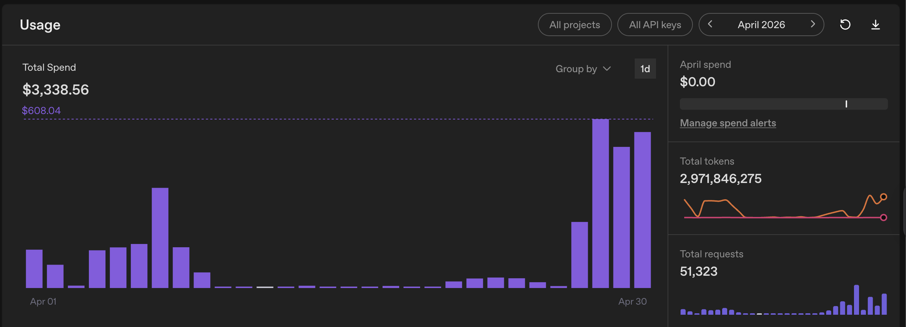

# Will AI bankrupt my lab?

Last week I logged into my OpenAI account and saw something I had never seen before: a negative balance. That was not supposed to happen.

A while ago, I gave my students access to lab API credits. A lot of our research touches large language models, agents, or AI-assisted workflows, so this felt reasonable. If a student needed to run an experiment, test a prompt pipeline, debug a model-assisted tool, or use an API for a small research task, they should not have to pay out of pocket.

For a long time, this worked fine. Most students used ten dollars here, twenty dollars there, maybe a few dozen dollars for a concrete experiment. The cost was real, but the return in speed and exploration seemed worth it.

Then I opened the billing page.

The account that had still had a few thousand dollars in credit was suddenly below zero. After digging through the usage logs, I found that two students had spent more than $2,000 in about a week. In April, the lab burned through more than $3,000 in API credits.

To put that in perspective, $3,000 is roughly a month of RA support in many settings. It is not a small software bill. It is a person-month.

## The expensive lesson

At first, I assumed something had gone wrong. Maybe an API key had leaked. Maybe somebody had accidentally left a script running. Maybe there was some runaway job in the background.

The main reason turned out to be something much more ordinary: **coding agents**. Students had connected the lab API key to tools like Cursor or Codex-style coding agents and let them work, especially when their subscription runs out. The agents helped them write code, debug, and restructure projects. They just did not realize what the price tag can be.

This is the strange part of the story. The students are using AI to work (sometimes eager to finish the work and can not wait for the limits to reset).

## Tokens are becoming research infrastructure

A few months ago, I told a colleague that in the future, one of the things separating productive labs from less productive ones, especially in computer science, might simply be **token budget**.

A lab that can afford to let every student use strong models all day may move faster than a lab that cannot. Students with generous access can ask agents to inspect codebases, generate tests, try implementations, clean data, summarize papers, draft analysis scripts, and explain unfamiliar libraries. Even when the outputs are imperfect, the iteration speed changes.

The question is what happens when it becomes normal. If the next generation of research workflows depends on having continuous access to frontier models, then tokens start to look less like optional software spending and more like lab infrastructure. They become the new cluster queue, the new GPU allocation, the new invisible resource behind productivity.

And then a very uncomfortable question appears: *can my lab afford to compete in that world*?

## The current pricing may be an illusion

Right now, many of us experience AI through subscription plans: $20 or $100 a month. Sometimes more. These plans make the tools feel almost like utilities: pay a flat fee, use them whenever you need them, do not think too much about the marginal cost.

But if you price the same usage through an API, the economics can look completely different. Look at what has happened to my bill! A heavy user can burn through a monthly subscription's worth of value very quickly. Depending on the model and the workflow, it may take hours or much less to spend what looks like a generous monthly plan.

That suggests something awkward: model companies may still be subsidizing a lot of our usage, directly or indirectly. They are competing for users, market share, and developer mindshare. The flat-rate plans make sense in that environment.

But what if that environment does not last?

What happens when the competition cools down, or when the models become too expensive to subsidize at current levels, or when providers decide that heavy users should pay closer to their real cost?

At that point, we may discover that what felt like a cheap AI assistant was actually expensive compute with a very friendly wrapper.

And if every student has to pay the real marginal cost of their AI usage, then the question changes from "which tool should we use?" to "who can afford to think with the best models?"

## The PI problem

As a PI, what am I responsible for providing?

If my students need powerful coding models to work efficiently, should I buy everyone the best coding subscription? If I do not, am I putting them at a disadvantage? If I only provide a shared API key, am I accidentally creating a system where the most expensive usage pattern becomes the default? If a student does not want to pay for a personal subscription, is it fair for them to route all coding-agent work through the lab key?

On one hand, I do not want students paying personally for tools that are really part of their research work. That feels wrong. A lab should not quietly shift research costs onto students, especially when those students may have very different financial situations.

On the other hand, a shared API key with no budget and no norms is clearly not sustainable. It turns token spending into a commons problem. Students who use agents most aggressively get the greatest benefit. A careful student who worries about cost may use weaker tools and move more slowly. A more aggressive student may burn hundreds of dollars in a day. If nobody can see the cost until the end, the incentives are terrible.

## A token budget may become part of hiring

There is a brutal way to think about this. When I support a student, I already think about salary, tuition, travel, equipment, and sometimes computers. Maybe now I also need to think about an AI budget attached to that person.

Not as a perk. As part of the cost of doing modern research. If one researcher needs a laptop, a server account, conference travel, and $200 or $500 or $1,000 a month in model access, then the real cost of supporting that researcher is higher than the salary line alone.

That sounds extreme until you watch a coding agent spend $600 in one day. Of course, most projects should not need that level of spending. A lot of tasks can be done with cheaper models, local models, smaller contexts, better prompts, or simply more human judgment. But the direction is clear enough: AI usage is becoming a budget category.

The question is whether universities, grant agencies, and labs are ready to treat it that way.

## What I will probably change

I do not have a perfect answer yet. But after seeing the bill, I know the old model cannot continue. A lab API key cannot be treated like free electricity.

At a minimum, I think we need a few basic norms:

1. **Separate keys by person or project.** Shared keys make it too hard to understand who spent what and why.

2. **Set budgets before usage, not after the bill arrives.** A student should know whether a task is a $5 experiment, a $50 experiment, or a $500 experiment.

3. **Use alerts and hard limits.** If a tool can burn hundreds of dollars in a day, the default should not be unlimited spending.

4. **Match model strength to task.** Not every debugging session needs the most expensive model at the highest reasoning setting.

5. **Discuss AI spending openly in the lab.** Token usage should become part of research planning, the same way GPU time or participant payments are.

6. **Protect students from paying out of pocket by default.** If a tool is necessary for lab work, we should not pretend it is a personal hobby expense.

## I am still not sure what the right norm should be

Should every lab provide premium AI tools to every student? If not, what baseline should a lab provide? Should grants include explicit token budgets? Should universities negotiate institutional access the way they do for journals and software? Should students be trained in AI cost awareness the same way we train them not to waste cluster resources? And at a more basic level: how much AI access is now necessary to do competitive research?

*I do not know*.

What I do know is that the old assumption — that AI tools are cheap enough to be treated casually — is starting to break. The bill is becoming visible. Once it is visible, we have to decide who pays it, how it is allocated, and what kind of research culture it creates.

I just hope AI won't bankrupt my lab in the future.
