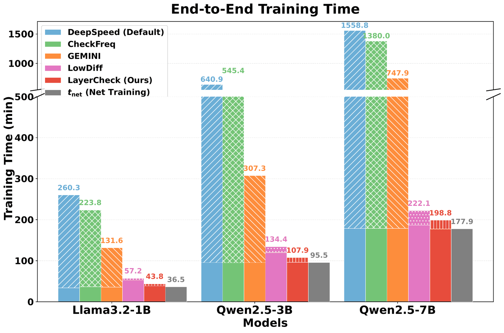
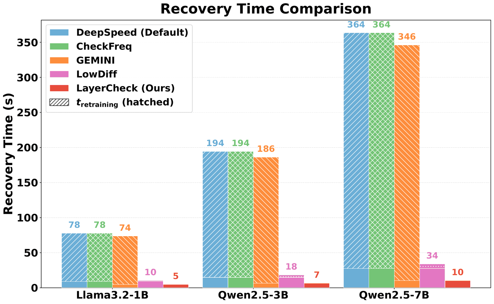
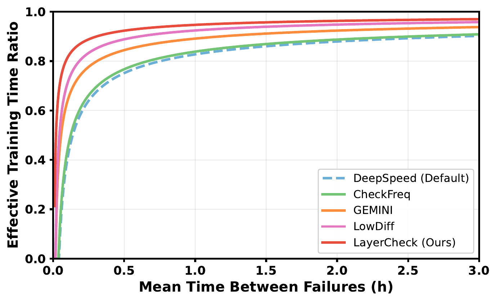

## The problem: saving everything, every time

Training a large language model takes long enough that something will break before it finishes. Pre-training runs on thousands of GPUs for weeks or months. Post-training — the supervised fine-tuning and alignment stages this paper is about — still needs hundreds of GPUs for days or weeks. At that scale, failures are routine: one report puts them as often as every 45 minutes.

The standard defense is checkpointing. Frameworks such as DeepSpeed and FSDP periodically write the full training state — model weights, optimizer moments, scheduler and RNG state — to storage, so a crashed job can resume from the last save instead of from scratch.

The cost is a trade-off that gets worse as jobs grow. Checkpoint rarely and you lose more work to each failure. Checkpoint often and you pay more I/O, and that I/O stalls training. Prior work measures checkpointing at up to 12% of total training time, and as much as 43% in extreme cases.

Systems that attack this cost fall into three groups. Some overlap checkpoint I/O with computation (GEMINI, DataState-LLM). Some compress checkpoints after the fact (Delta-DNN, ExCP) — but the full checkpoint still has to be written first. Some persist only what changed (Check-N-Run, LowDiff, Amber), at the cost of per-parameter tracking or gradient replay at recovery. All of them decide what to write with a rule that treats the model as one object.

**LayerCheck starts from a different question: does every layer need saving every time?** Its answer is no. During post-training, transformer layers change at very different rates. LayerCheck saves a layer only when it has moved enough to matter, and at recovery it rebuilds a full training state from the most recent saved copy of each layer.

## The observation: layers don't move together

The paper's motivating measurement is the heatmap above. Each row is one of the 31 layers of Qwen2.5-7B — 28 transformer blocks plus the embedding table, the output head, and the final normalization. Each column is a training step. Color tracks how much a layer's weights have changed, accumulated since the last time that layer crossed the threshold, at which point its counter resets as if it had just been checkpointed.

If all layers moved in lockstep, every row would reset at the same steps and the plot would show vertical stripes. Instead it shows waves: the embedding resets constantly, the output head almost never does, and the transformer layers cross the threshold at staggered, drifting intervals. A full-model checkpoint at any given step is rewriting many layers that have barely changed since the last write.

## How LayerCheck works

The system has three stages.

**Online monitoring.** During training, LayerCheck keeps one number per layer: how much that layer has changed, in total, since it was last written to disk. The number is cheap to maintain because it is computed from tensors the optimizer already has in hand during the update.

**Selective persistence.** At each checkpoint opportunity, a layer is written only if its accumulated change crosses a threshold. When a layer is written, LayerCheck writes the whole layer state — its weights *and* the Adam moments that belong to those weights — and resets the counter. Fast-changing layers are refreshed often; slow ones are skipped. Because different layers cross the line at different steps, checkpoint writes spread out over time instead of arriving as periodic bursts.

**Composite recovery.** After a failure at step *t*, recovery does not roll back to the last full snapshot. For each layer it finds the most recent saved copy at or before *t*, loads that layer's weights together with its matching optimizer tensors, and places them back into the model's layout. The result is a full checkpoint assembled from layers saved at different steps. Training resumes at *t* + 1 with no replay of lost iterations.

## Deciding what to save

The per-layer signal is a normalized update magnitude. At each step, LayerCheck takes the element-wise absolute change in a layer's weights, averages it, and divides by the average magnitude of the weights themselves. That value is added to the layer's running accumulator.

Two choices in this definition are deliberate. Using absolute values means positive and negative changes across parameters cannot cancel each other, so the accumulator over-counts rather than under-counts drift — it biases toward saving slightly too often instead of missing a meaningful change. Using the mean rather than a max keeps a handful of outlier parameters from triggering a write.

A layer is persisted when its accumulator crosses a threshold *K*. Rather than one fixed value, *K* is a base threshold scaled by the current learning rate, so that warm-up and decay in the schedule do not silently change how often layers get saved. The default base threshold is 10⁻³, a scale prior work has found to be a meaningful unit of relative parameter drift during fine-tuning. Embeddings update in smaller steps, so they get a larger base threshold (10⁻²) to avoid persisting them constantly. During the first 200 steps, selective persistence is off and one full base checkpoint is taken as a fallback for layers that rarely update afterward.

## What "stale" means, and how it is bounded

The obvious risk in composite recovery is that the recovered model never existed. Layer 5 might come from step 968 and layer 20 from step 928 — a mixed-timestamp state that failure-free training never passed through.

The paper names this quantity *staleness*: for a failure at step *τ* and a layer last saved at step *t*, the layer's staleness is *τ* − *t*. Two things keep it in check.

First, the threshold itself. With the default settings, most layers naturally cross the threshold and get refreshed roughly every 200 iterations.

Second, an explicit guard. The user sets a budget *S*max. If any layer's staleness reaches *S*max, LayerCheck forces that layer out to disk at the next opportunity, whether or not its accumulator crossed the threshold. The paper uses *S*max = 1000 and reports that in practice the guard is a rarely triggered safety backstop.

The figure shows why the guard is about the worst case rather than the typical one. The maximum per-layer staleness climbs toward 800 steps between steps 200 and 1000, but that line is set by the normalization layer, whose contribution to the checkpoint is negligible. Weighted by parameter count, the average staleness of the checkpoint stays low and peaks at 115 steps.

This bound also carries the paper's convergence argument. Following the style of analysis in ExCP, the authors show that under standard Adam assumptions, a recovery from a state with bounded staleness adds a bounded term to Adam's regret without changing its asymptotic average-regret rate. Multiple recoveries add up their terms, and for a fixed number of failures the rate is still unchanged. The paper presents this as a proof of concept rather than a tight bound.

## Recovering from a mixed-timestamp checkpoint

Recovery is driven by metadata. While training runs, LayerCheck records which layers were persisted at which step. On failure it derives a per-layer plan from that record — for each layer, the newest saved copy at or before the failure step, falling back to the base full checkpoint if a layer has never been saved on its own — and assembles a DeepSpeed-compatible full checkpoint from those pieces.

The reason optimizer state is saved *with* each layer, rather than separately, is exactly this step. Adam's first and second moments for a layer are only meaningful alongside the weights they were computed against. Saving them together means each recovered layer is internally consistent even when the checkpoint as a whole spans multiple timestamps.

## Does recovery hurt the model?

This is the question the paper has to answer before any of the savings matter. The experiments run on one server with eight A100 40 GB GPUs, a 100 TB Lustre file system, DeepSpeed ZeRO-3, and AdamW, fine-tuning three open models — Llama-3.2-1B, Qwen2.5-3B, and Qwen2.5-7B — on two datasets, MedQA (medical) and OpenThoughts (reasoning).

To stress recovery, failures are injected at the single worst moment: the step where the parameter-weighted average staleness is highest for a given threshold. For Qwen2.5-7B on OpenThoughts with the default threshold, that is step 299.

The recovered run tracks the failure-free trajectory through all three restarts with no visible drift or compounding instability. Measured at the end of training, the maximum absolute deviation in loss is 0.0024 — 0.54% relative — which the paper characterizes as within step-to-step training noise. A second experiment varies the threshold across 10⁻², 10⁻³, and 10⁻⁴ under a single failure: a looser threshold produces a slightly higher loss band right after restart, a tighter one a smaller deviation, and in every case the gap stays bounded rather than growing.

Loss alone does not settle the question, because fine-tuning loss correlates imperfectly with benchmark scores. So the paper also evaluates the final models on seven downstream benchmarks. The Qwen2.5-7B rows:

| Dataset | Run | ARC-easy | HellaSwag | Lambada | PIQA | MedMCQA | MMLU-Med | PubMedQA |
| --- | --- | --- | --- | --- | --- | --- | --- | --- |
| MedQA | Failure-free | 81.44 | 60.59 | 67.07 | 79.43 | 60.39 | 92.00 | 75.20 |
| MedQA | Recovered at step 888 | 81.78 | 60.36 | 67.30 | 80.03 | 60.41 | 93.00 | 75.60 |
| OpenThoughts | Failure-free | 79.92 | 59.70 | 68.87 | 77.97 | 59.86 | 85.00 | 75.20 |
| OpenThoughts | Recovered at step 299 | 80.35 | 59.63 | 68.37 | 78.24 | 59.74 | 85.00 | 75.00 |

Across all three models and both datasets, recovered runs match the failure-free scores closely, with differences in both directions and no systematic degradation.

## What it saves during training

The steady-state experiments use a deliberately harsh regime — a checkpoint at every iteration — following earlier checkpointing systems. The point is to expose what each method does under I/O pressure, not to model a typical production schedule. Baselines are DeepSpeed's default, CheckFreq (overlapped checkpointing), GEMINI (overlapped plus in-memory checkpointing), and LowDiff (differential checkpointing that writes per-iteration gradients).

LayerCheck finishes fastest on all three models. Its total overhead relative to checkpoint-free training is 11.7–20.0%. On Llama3.2-1B it is 1.31× faster than LowDiff (43.8 vs. 57.2 minutes); on Qwen2.5-7B it is 3.76× faster than GEMINI (198.8 vs. 747.9 minutes), and the gaps to CheckFreq and the DeepSpeed default are larger still.

The paper is careful about why. LayerCheck's checkpoint fraction (10.7–12.0% of runtime) is about the same as LowDiff's (9.3–15.9%), yet the end-to-end times differ substantially. Under per-iteration checkpointing, the baselines must drain full-model-scale checkpoint work every step; once that work takes longer than one training iteration, overlap breaks down and training visibly stalls. Pipelining better does not fix this — only reducing the amount of state does. Subtracting checkpoint time from LayerCheck's bars leaves essentially the no-checkpoint baseline, which confirms that the per-step drift tracking itself costs nothing measurable.

The bytes tell the same story. On OpenThoughts with the default threshold:

| Model (layers) | Method | Layer writes | Checkpoints | Total size (GB) | Mean size (GB) |
| --- | --- | --- | --- | --- | --- |
| Qwen2.5-7B (31) | DeepSpeed default | 52,452 | 1,692 | 180,367 | 106.6 |
| | LowDiff | — | 930 | 19,259 | 20.7 |
| | **LayerCheck** | **319** | **277** | **1,205** | **4.35** |
| Qwen2.5-3B (38) | DeepSpeed default | 64,296 | 1,692 | 73,111 | 43.2 |
| | LowDiff | — | 930 | 8,513 | 9.15 |
| | **LayerCheck** | **340** | **273** | **376** | **1.38** |
| Llama3.2-1B (18) | DeepSpeed default | 30,456 | 1,692 | 29,305 | 17.3 |
| | LowDiff | — | 930 | 3,837 | 4.12 |
| | **LayerCheck** | **266** | **242** | **265** | **1.02** |

Relative to LowDiff, LayerCheck cuts total checkpoint storage by up to 22.6× (about 17× on average across the three models) and mean per-checkpoint size by up to 6.6×. The "layer writes" column is the mechanism made visible: over the whole run, LayerCheck wrote 319 individual layers of Qwen2.5-7B, where a full-model checkpoint at every iteration writes 52,452.

The threshold is the knob that trades freshness for bytes. On Qwen2.5-7B, moving *K* from 10⁻³ to 10⁻² cuts the total from 1,205 GB to 393 GB; moving it to 10⁻⁴ raises it to 9,376 GB. The paper settles on 10⁻³ as the operating point that balances recovery fidelity against cost in its workloads.

## What it saves after a failure

Comparing recovery time is easy to get wrong. A method looks fast if it simply checkpoints more often, and slow if it has to replay more lost iterations. The paper controls for this with a matched-freshness protocol: LowDiff and LayerCheck keep their native per-step persistence, while the rollback-based baselines (DeepSpeed default, CheckFreq, GEMINI) get a checkpoint interval equal to LayerCheck's observed average staleness — 106 steps on Qwen2.5-7B — so that a uniformly random failure costs them an average rollback of 53 steps.

On Qwen2.5-7B, LayerCheck recovers in 10 seconds against 34 for LowDiff — 3.4× faster — and 346–364 seconds for the rollback-based methods, which spend nearly all of that time replaying the 53 lost steps. The same ordering holds at 3B (7 s vs. 18 s) and 1B (5 s vs. 10 s). The saving comes from two directions: less state was written during training, so less has to be loaded; and composite recovery restarts near the failure point, so nothing has to be replayed.

One caveat the paper states explicitly: reconstruction time — layer merging for LayerCheck, decompression for others — is excluded from the comparison, because GEMINI and LowDiff do not ship complete public recovery implementations and the cost is highly implementation-dependent.

## When failures are frequent

The last experiment asks what happens at the scale where failures are common. Using per-iteration training time, checkpoint overhead, and recovery time measured on Qwen2.5-7B, the paper simulates training under mean-time-between-failures values from 0.01 to 3 hours and reports the *effective training time ratio* — the fraction of wall-clock time spent on forward, backward, and optimizer work rather than on checkpointing and recovery.

LayerCheck has the highest ratio at every point on the curve. At an MTBF of half an hour, it keeps 92.3% of wall-clock time on useful training, against 88.8% for LowDiff and 84.5% for GEMINI. This is where the two earlier results compound: the system that both stalls least in steady state and recovers fastest after a failure wins by more as failures become more frequent.

## Implementation notes

LayerCheck is implemented on PyTorch and DeepSpeed ZeRO-3, and the design goal is to be non-intrusive: between failures, training runs the standard AdamW update, and LayerCheck only adds drift bookkeeping and filters what gets serialized.

Two details make per-layer persistence workable in practice. Optimizer state under ZeRO-3 lives in flattened tensors and parameter groups that do not expose layer boundaries, so LayerCheck rebuilds the optimizer's parameter groups to mirror the model's layers — two groups per transformer block (with and without weight decay) — while preserving the original weight-decay policy. That layout makes it possible to locate the optimizer shard for a given layer both when writing and when reconstructing. And drift is computed on the optimizer's update path, reusing tensors that are already materialized, rather than by copying weights and diffing them.

Under ZeRO-3, each rank checkpoints its own shard independently, so LayerCheck's core behavior — drift tracking, selective writes, composite recovery — is determined per rank. The paper evaluates on a single sharded node on that basis and extends to scale-out regimes through the simulation above, following the methodology of recent checkpointing systems.

## Limits, and what comes next

The authors name three. The absolute size of the gains depends on the storage backend: faster local storage lowers checkpoint cost for every method, although writing fewer bytes still makes training less sensitive to storage variability. Reconstruction time is left out of the cross-method recovery comparison for the reason given above. And the implementation and analysis target AdamW; the persistence decision is based on realized weight changes rather than Adam-specific statistics, so the idea transfers conceptually to plain SGD, but the base threshold would need to be recalibrated for a different optimizer's update scale.

The stated next step is to combine LayerCheck with overlap-oriented checkpoint pipelines, so that the reduced checkpoint work also benefits from end-to-end overlap across computation, communication, and I/O.

## Why this result matters

The reusable idea is a granularity argument. Checkpointing systems have treated the model as one object and asked how to write it faster, compress it smaller, or diff it against its previous version. LayerCheck observes that the object has internal structure with very different rates of change, and that respecting the structure removes most of the work: write the parts that moved, keep each part self-consistent by saving its optimizer state alongside it, and bound how old any part is allowed to get.

The bound is what makes the rest defensible. Without it, a composite checkpoint is a state that never existed; with it, the deviation from failure-free training is a controlled quantity, one the paper can both bound analytically and measure at 0.54%. For anyone running post-training jobs long enough to fail, that is the difference between checkpointing that is a tax and checkpointing that is nearly free.
