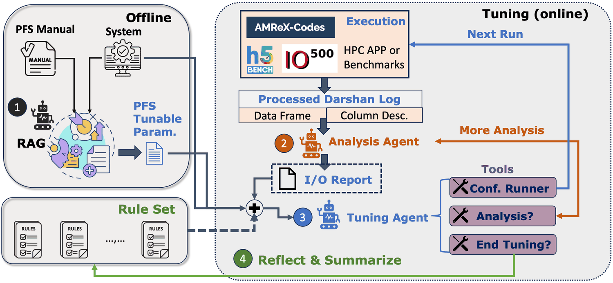
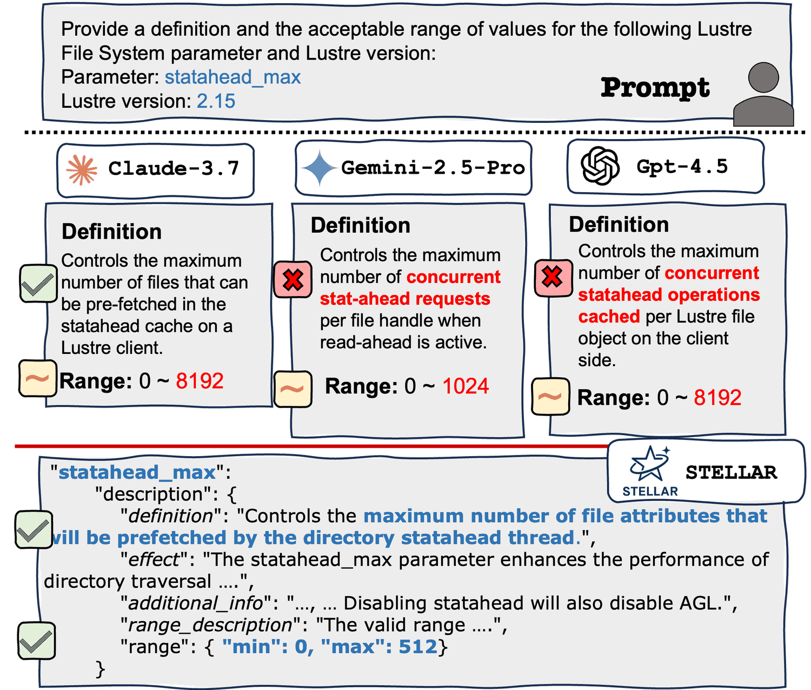
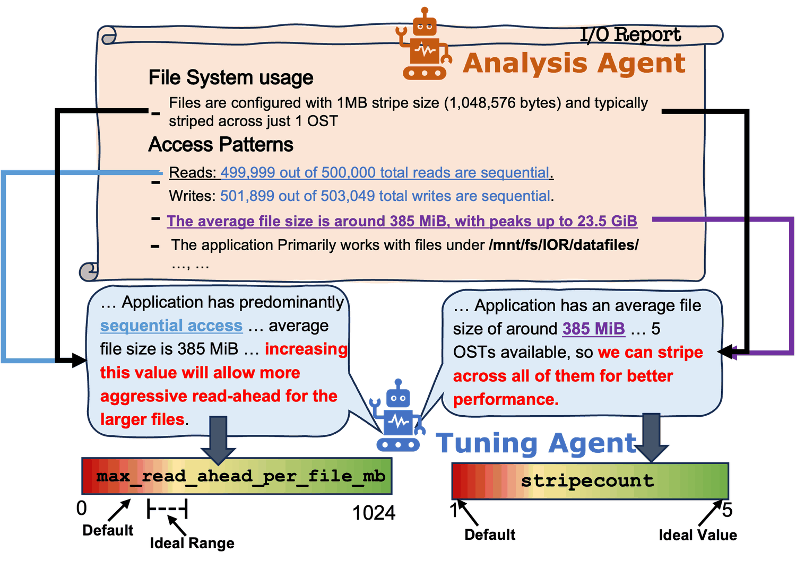
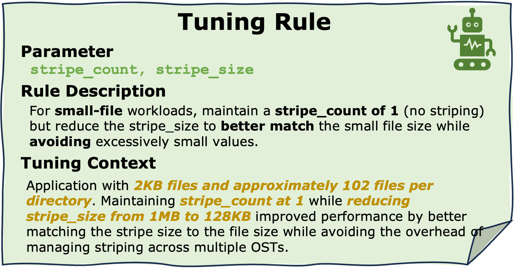
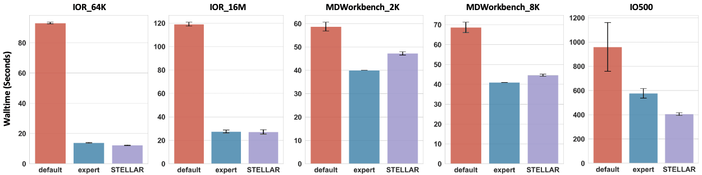
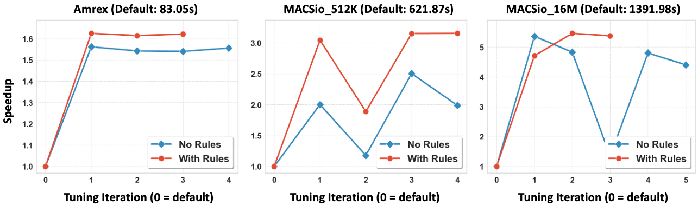
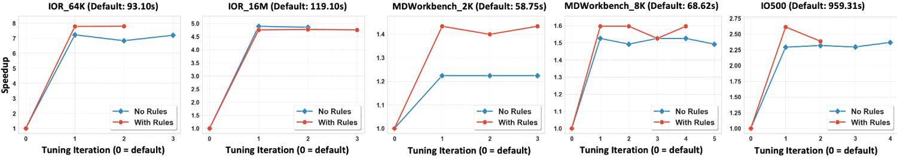
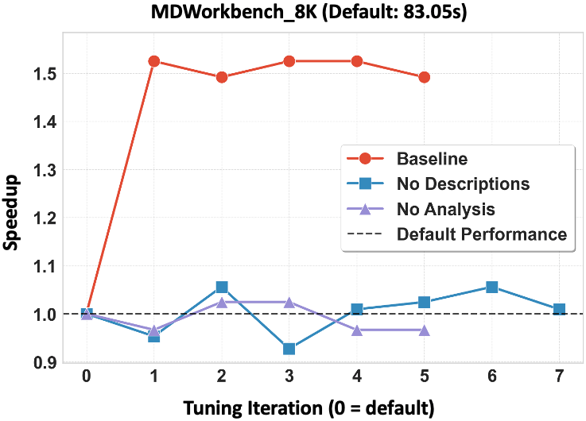
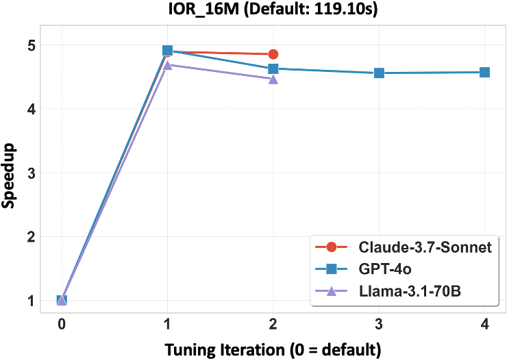
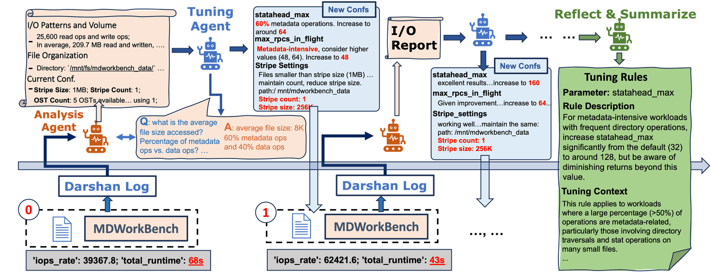

## The problem: a knob nobody can turn

Parallel file systems ship with a lot of knobs. Lustre 2.12.5 exposes at least 159 tunable user parameters; the Ceph Nautilus release comes with 1,536 parameters, though not all of them are meant to be tuned. The right value for a knob is not a property of the file system alone — it depends on how the application writes: how big the transfers are, whether access is sequential or random, whether the run is dominated by data or by metadata operations.

In practice, this is handled once and then frozen. System administrators run benchmarks during installation and publish a recommended configuration for the whole machine. That process is manpower-intensive, and the result is a single compromise that no individual application actually wants. For a domain scientist who just wants their simulation to write faster, retuning is not on the table.

Automated tuners exist, built on heuristics, machine learning, and reinforcement learning. They share one problem: they need hundreds to thousands of iterations or training samples to explore the space. Every iteration is a real run of a real scientific application on a real cluster. The bottleneck is not the search algorithm — it is that each sample costs a job.

Human experts do not work that way. Given a new application, an I/O expert reads its trace log, recognizes the pattern, picks a starting configuration from experience, runs it once, and adjusts. They land near-optimal in a handful of attempts because they bring knowledge to the problem instead of sampling their way through it.

**STELLAR is an attempt to automate that behavior rather than the search.** It is an agentic LLM system that reads the file system manual, reads the application's I/O trace, proposes a configuration, reruns the application, and reflects on what happened — and it stops within five attempts.

## How STELLAR works

The system has two halves.

**Offline**, before any tuning happens, a retrieval step reads the parallel file system manual and returns a short list of high-impact parameters, each with an accurate description and a valid range.

**Online**, the tuning loop runs. The application is executed once to produce a Darshan trace. An *Analysis Agent* turns that trace into an I/O report. A *Tuning Agent* takes the report plus the parameter list plus the hardware description, and drives a trial-and-error loop through three tools: ask for more analysis, run a new configuration, or stop. When it stops, a reflection step summarizes the run into rules, which are merged into a global rule set and prepended to the next application's tuning run.

## Step 1: read the manual, not the model's memory

Asking a language model to describe a storage parameter is the obvious approach, and it does not work. Parallel file systems are a narrow domain with limited organized documentation and few popular discussion boards — exactly the conditions under which models produce confident, wrong answers.

The paper tests this directly on `statahead_max` in Lustre 2.15, asking three frontier models for its definition and accepted range. None of the three returned an entirely correct response. All three were wrong about the parameter's maximum accepted value, and both GPT-4.5 and Gemini-2.5-Pro gave flawed definitions. A tuning agent working from those answers will set values that are invalid, or valid and pointless.

Feeding the manual into the model instead does not fix it either. The Lustre manual runs over 600 pages — more than 300k tokens. Even models that accept contexts that long lose material in the middle, drop long-range dependencies, and degrade as the context fills.

So STELLAR retrieves instead. The manual is chunked and embedded with LlamaIndex using 1,024-token chunks, 20-token overlap, and OpenAI's `text-embedding-3-large`. Then a multi-step filter runs:

1. **Start from what is actually settable.** Lustre exposes parameters under `/proc/fs/` and `/sys/fs/`; a coarse filter keeps only the writable ones.
2. **Ask the manual about each one.** For each parameter, STELLAR queries the index with `"How do I use the parameter [name]?"` and retrieves the top 20 chunks. GPT-4o then decides whether those chunks are enough to define the parameter's purpose and valid range. If yes, it writes the description and the range. If not, the parameter is dropped — a parameter the manual does not describe is assumed to be less important than one it does.
3. **Drop the trade-offs.** Binary parameters are excluded. Lustre's checksum flags, for example, do move I/O performance, but turning them off trades data integrity for speed. That is a user's decision, not a tuner's.
4. **Keep what plausibly moves performance.** The model is asked, with written reasoning, whether each remaining parameter is likely to matter. `max_rpcs_in_flight` controls how many RPCs can be in flight between clients and object storage targets, so it stays. `nrs_delay_min`, `nrs_delay_max`, and `nrs_delay_pct` simulate high server load, so they go.

Some ranges cannot be written down as constants. In Lustre, the maximum value of `max_read_ahead_per_file_mb` is half of `max_read_ahead_mb`, whose own maximum is half of system memory. For those, the model emits a dependency expression that STELLAR evaluates against the actual machine at tuning time.

For Lustre, this pipeline reduces 159+ exposed parameters to **13 that STELLAR will tune**.

## Step 2: two agents, three tools

**The Analysis Agent** explains what the application is doing. Darshan logs are preprocessed into Pandas DataFrames — one per module, POSIX, MPI-IO, and so on — alongside string variables describing what each counter means. The agent is built on OpenInterpreter, so it writes and executes its own analysis code against those DataFrames rather than reading raw logs. Its standing task is broad: summarize the application's I/O behavior, identify the files it touches, and surface anything useful for tuning. Because the task is broad, the agent decides what matters for this particular application instead of filling in a fixed template.

**The Tuning Agent** makes the decisions. It starts with the 13 parameters, the hardware and storage layout, and the Analysis Agent's I/O report, and then picks one of three tools each step:

- **`Analysis?`** — something needed is missing, so it writes a specific question back to the Analysis Agent.
- **`Configuration Runner`** — it commits to a set of values and reruns the application. It must write down the rationale for each value it chooses. That rationale is what makes the run auditable, and it is the raw material for the rules generated later.
- **`End Tuning?`** — it stops, and must justify stopping. The system prompt tells it to end only when it believes further tuning will not gain anything.

The two agents form a minor loop (report → follow-up question → better report) inside the main trial-and-error loop (configure → run → observe → configure).

The paper is explicit about why this is a pair of autonomous agents rather than a fixed workflow: workloads differ in how hard they are to tune, so the process needs to stretch or stop early, and different applications need their I/O summarized along different axes.

## Step 3: keep what was learned

When a tuning run ends, the Tuning Agent is asked to summarize what it learned as a rule set. Each rule is JSON with three keys: `Parameter`, `Rule Description`, and `Tuning Context`. The prompt forbids naming the application being tuned and pushes for general guidance rather than specific values — a stripe-size rule says the setting should follow the file size, not "set it to 4 MB". The tuning context records the I/O characteristics of the workload where the rule was learned, which is what lets a later run decide whether the rule applies.

Merging matters as much as generating. When a new rule directly contradicts an existing rule at the same tuning context, both are removed, because there is no basis for deciding which one is right. When two rules give slightly different guidance in the same context, they are kept as alternatives so a future run can try both — and when a future run does try both and only one works, the loser is dropped.

## Does it work?

**Setup.** All evaluations ran on CloudLab, since changing system-level Lustre parameters requires root. Ten machines: Intel Xeon Silver 4114 (10 physical cores), roughly 196 GB of memory each, 10 Gbps network. Lustre 2.15.5 with five object storage servers and one combined management/metadata server; the remaining five machines act as clients. Every workload runs with 50 MPI processes across the five client nodes. Each case is run eight times and reported with a 90% confidence interval; between runs the data is deleted, caches are cleared, and the file system is remounted. STELLAR is capped at five configurations per tuning run.

| Workload | What it stresses |
| --- | --- |
| `IOR_64K` | Random small writes: 128 MB per process, 64 KB transfers, shared file |
| `IOR_16M` | Sequential large writes: 3 × 128 MB per process, 16 MB transfers, shared file |
| `MDWorkbench_2K` | Metadata: 10 directories per process, 400 files each, 2 KB per file |
| `MDWorkbench_8K` | Metadata: same structure, 8 KB per file |
| `IO500` | Mixed, multi-phase: IOR-Easy, IOR-Hard, MDTest-Easy, MDTest-Hard |
| AMReX | Real I/O kernel: block-structured adaptive mesh refinement |
| `MACSio_512K` / `MACSio_16MB` | Multiphysics I/O proxy at two object sizes |

**Baselines.** Default Lustre settings, and a human I/O expert who was given the full benchmark description, the full Darshan trace logs, and practically unbounded time to produce a configuration.

Starting cold — no accumulated rules — STELLAR produced configurations much faster than the defaults across every benchmark and real application, and performed similarly to or better than the human expert. On IO500 it beat the expert baseline, which is the interesting case: IO500 runs multiple phases with different I/O patterns, so a single hand-picked compromise is hard to get right.

## Rules transfer across applications

The rule set is the part that turns a tuner into something that improves with use. The paper tests it in both directions.

**Interpolation.** Tune all benchmarks once with no rules, let the rule sets merge, then tune the same benchmarks again with the merged global rule set. In four of five cases the rule set gave a significantly better *first* guess. `MDWorkbench_2K` is the clearest win: in the cold-start results the human expert's configuration was slightly better, and the rule set closed that gap. Because the first guess was already good, STELLAR needed less exploration — it finished sooner in three of five cases and in the same number of iterations in one more.

**Extrapolation.** Harder: take rules accumulated only from the synthetic benchmarks and apply them to AMReX and MACSio, which STELLAR has never seen. In all cases the rule set produced more stable convergence and higher average performance per generated configuration. For `MACSio_16M`, it steered the agent away from configurations that performed about as well as the default. For `MACSio_512K`, it avoided the worst settings that the cold-start run had explored.

## What each part actually contributes

The ablations run on `MDWorkbench_8K`, which earlier results showed to be the hardest workload to tune.

**No Descriptions** removes the RAG-generated parameter descriptions but keeps the valid ranges — the ranges have to stay, because without them the Tuning Agent sets invalid values and tuning simply fails. Performance drops significantly, and the trace of the agent's reasoning shows why. It knows a stripe count of 1 is efficient for small files, but then claims that setting the parent directory's stripe count to `-1` would "distribute the files more evenly across all OSTs" — a misreading of what stripe count does. STELLAR's retrieved description states it plainly: "the number of Object Storage Targets (OSTs) across which a file will be striped." The retrieval step is not decoration; it is what keeps the agent's reasoning anchored to the actual system.

**No Analysis** removes the Analysis Agent, and with it both the initial I/O report and the ability to ask follow-up questions. The result is worse still: the Tuning Agent fails to beat the defaults in any meaningful way, and its reasoning shows it raising readahead and RPC-size parameters — a sensible move for large sequential I/O, and exactly wrong for a workload dominated by very small files. Without a description of the workload, a competent model reasons competently about the wrong problem.

## Does the choice of model matter?

The main evaluation uses Claude-3.7-Sonnet as the Tuning Agent, but the design only requires a tool-calling model. Rerunning `IOR_16M` with GPT-4o and with the substantially smaller open-source Llama-3.1-70B-Instruct produced configurations that perform similarly, with speedups up to **4.91×** over the default. The system's behavior comes from its structure — retrieval, trace analysis, real feedback, accumulated rules — more than from any one model.

## What it costs

Per tuning run, the Tuning Agent (Claude-3.7-Sonnet) processes roughly 100k input tokens and generates roughly 13k output tokens. The Analysis Agent (GPT-4o) processes roughly 400k input tokens and generates roughly 8k. Because both agents work by appending to a growing context, prompt caching applies well: with caching enabled, between 85 and 90 percent of input tokens over a run are served from cache.

Latency is not the issue. LLM inference adds a few seconds per tuning decision across all three providers tested, against HPC application runtimes measured in minutes to hours. End-to-end tuning time is dominated by running the application, which is precisely why cutting the number of runs from thousands to five is the whole point.

## One run, start to finish

The case study follows `MDWorkbench_8K`. The application runs once with default settings; the Analysis Agent turns the resulting trace into an I/O report. The Tuning Agent reads it and asks two follow-up questions — more detail on file sizes, and the ratio of metadata to data operations. From the answers it classifies the workload as heavily metadata-intensive, and its first configuration delivers a **1.58× speedup**. Encouraged, it pushes further in the same direction, finds diminishing returns on most parameters after two more rounds of exploration, ends the run, and writes a rule capturing both the guidance and the workload context in which it was learned.

## Limits, and what comes next

The evaluation ran on CloudLab rather than a production HPC system, because system-level parameter tuning needs root. Larger machines widen the configuration space and add scale-dependent effects — burst buffers, NVMe tiers, different network topologies all shift which parameter combinations work. The authors' argument is that the loop itself does not depend on scale: it runs the application, reads what happened, adjusts, and repeats, the same way an expert does on any size machine. They also note that bigger systems may respond more sharply to parameter changes, which would make the causal relationships easier, not harder, for the agent to see.

The stated next step is to work within the privileges a normal user actually has: application-layer parameters such as HDF5 settings and MPI-IO hints, user-space storage systems like DAOS that expose extensive tunability without root, and hybrid recommendations that cover both user-controllable and system-level knobs.

## Why this result matters

The reusable idea here is not "LLMs can tune Lustre." It is a template for optimization problems where the search space is large and every sample is expensive:

- **Ground the model in documentation, not recall.** Retrieval over the manual is what separates a correct parameter range from a plausible one, and the ablation shows the difference is not cosmetic.
- **Give the model a description of the actual workload.** Removing the trace analysis was the most damaging ablation. The model's reasoning stayed fluent; it was simply reasoning about a workload that did not exist.
- **Close the loop with real feedback.** Configurations are judged by rerunning the application, not by the model's confidence in them.
- **Write down what worked, with the context it worked in.** Rules that carry their tuning context transfer to unseen applications; rules that name specific values would not.

Where each sample costs a cluster job, cutting thousands of samples to five is not an incremental gain. It is the difference between a tuning method that exists in papers and one a domain scientist can actually run.
